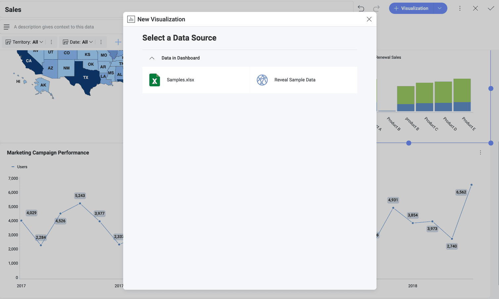
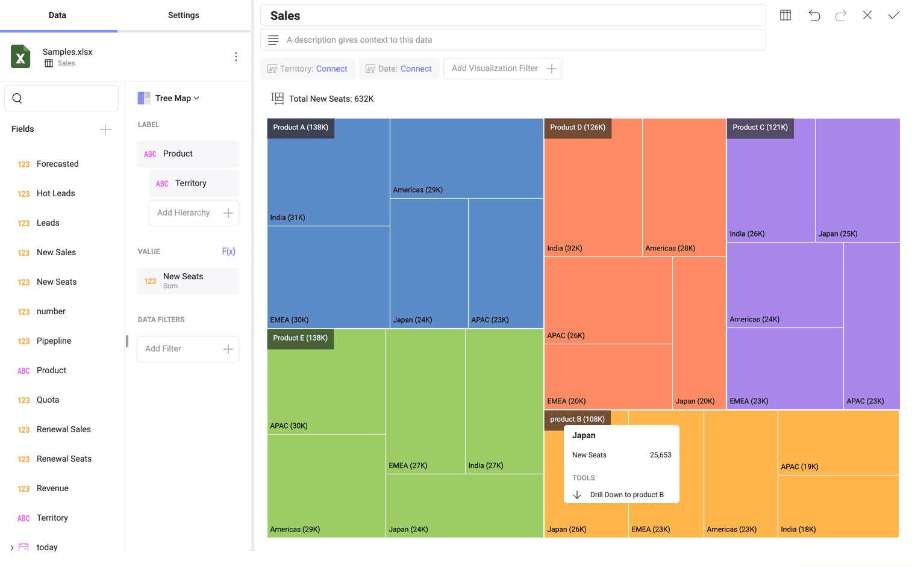
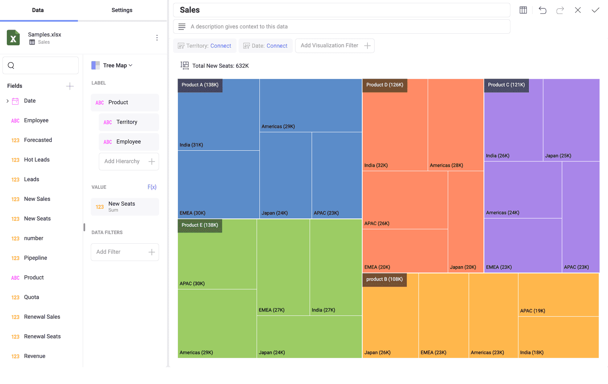
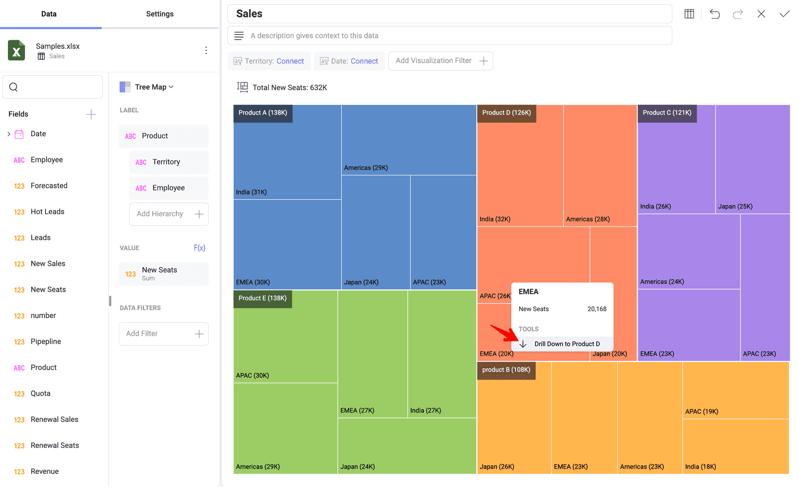
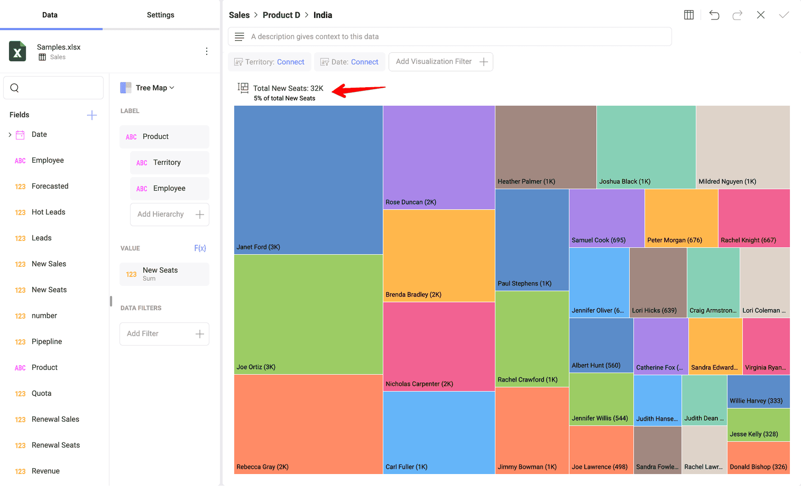
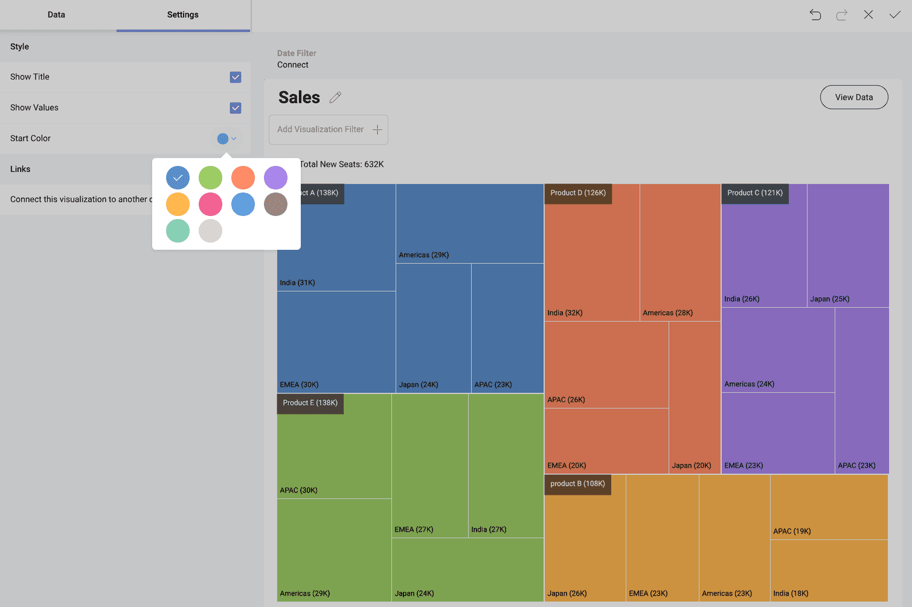

# Treemaps in Reveal

The Treemap visualization is used to display hierarchical data as a set of nested rectangles. Rectangles of each level are of different sizes and colors.

Each characteristic of the building tiles (rectangles) has a role in the data analysis:

  * **Color** - shows the categories by which the treemap visualization is divided. Fields data, used to define this characteristic, can be numerical (*123*), string (*ABC*), or date.
  * **Size** - shows the value for each category. Fields data, used to determine size, can only be numerical (*123*).
  * **Label** - shows the category and value for each rectangle in the visualization (i.e. [without hierarchical data](#treemap-visualizations-without-hierarchical-data)). When you have a [treemap visualization with hierarchical data](#treemap-visualizations-with-hierarchical-data), there is an additional label showing the category and value for the current level.

## Treemap Visualizations Without Hierarchical Data

You can create a **visualization without hierarchical data** like the one shown below:

You can use treemaps with no hierarchies to show patterns and part-to-whole relations in an attractive and clear way.

The visualization above displays *New Seats* by *Product*. To build this visualization, you need to do the following:

1. In the *New Visualization* dialog, choose *Sample Data*.

    

2. In the *Visualization Editor* choose the **Treemap visualization**.

    

3. In the *Treemap Data section* drop *Product* in **Label**, and *New Seats* in **Value**.

Note that the *data dropped in Label* (*Product*) determines the **color** and tiles the visualization in five different rectangles.

The biggest tile indicates the largest *New Seats* value. Rectangles are *arranged in size from top left (biggest) to right bottom.*

*The label at the left bottom* of each rectangle shows rounded approximate value for each product. To see exact values, click/tap on a tile to show tooltips (see the screenshot below).

 

## Treemap Visualizations With Hierarchical Data

Handling hierarchical data is the treemap's initial purpose. You can have only one value metric, but unlimited different categories, organized into hierarchy.

In the example above, the treemap is split into five big rectangles (branches of the treemap), determined by the *Product* category. Each of them *contains smaller rectangles*, determined by the next category level - *Territory*. Lower levels are not presented.

You may notice *two kinds of labels* in the example above:

- For the big rectangles, top left - show information about total new sales of each product.
- For the smaller rectangles, bottom left - show how much of each product is sold in a particular country.

Information about the color and size characteristics of the tiles is similar to what was said about the [Treemaps without hierarchies](#treemap-visualizations-without-hierarchical-data).

### Drilling Up and Down Hierarchy Levels

You can drill up and down the treemap visualization to navigate between different hierarchy levels. To do this, *click on a big rectangle* area (irregardless of the tiles it contains). In the tooltip, select *Drill Down/Up to*.

### Treemap Levels Specifics

When you reach the bottom of the hierarchy (the last field dropped in *Label*), your visualization will look exactly like the [flat treemaps](#treemap-visualizations-without-hierarchical-data).

The *totals label* over the top of the treemap visualization (on the left) changes at every level. The *Totals* reflect the changes in the *Value* field for each hierarchy level in *Label* (compare totals in the previous examples). In the example above, the totals label shows all new sales of product B in Japan.

Use the *breadcrumbs in the title* to identify the current level, which is displayed. You can also click/tap on them to navigate (instead of drilling up).

## Working With the Visualization Editor Settings

In the *Settings* section of the Treemap visualization, you can configure the following:

- **Show Title** - choose whether to show the visualization's title
- **Show Values** - choose whether to show **labels**, displaying information about categories and values for rectangles at different levels
- **Start Color** - choose a start color from a 10-color palette. Reveal will use your choice to adjust a color scheme.
- **Links** - connect the visualization to a dashboard or URL. For more information, please refer to the [Linking Dashboards](../dashboard-linking) topic.
