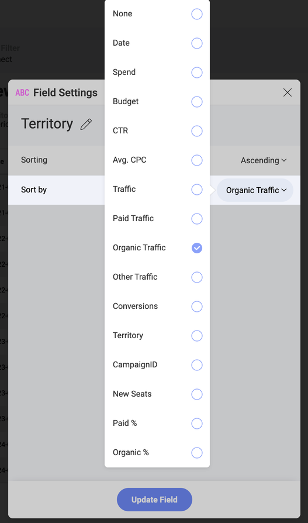
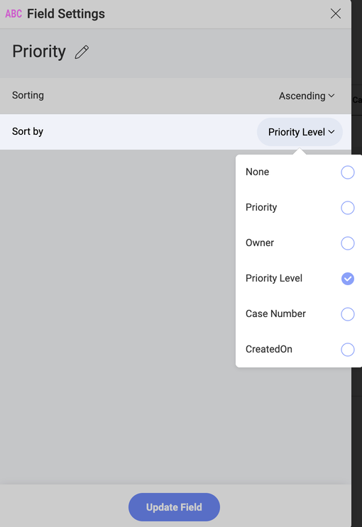
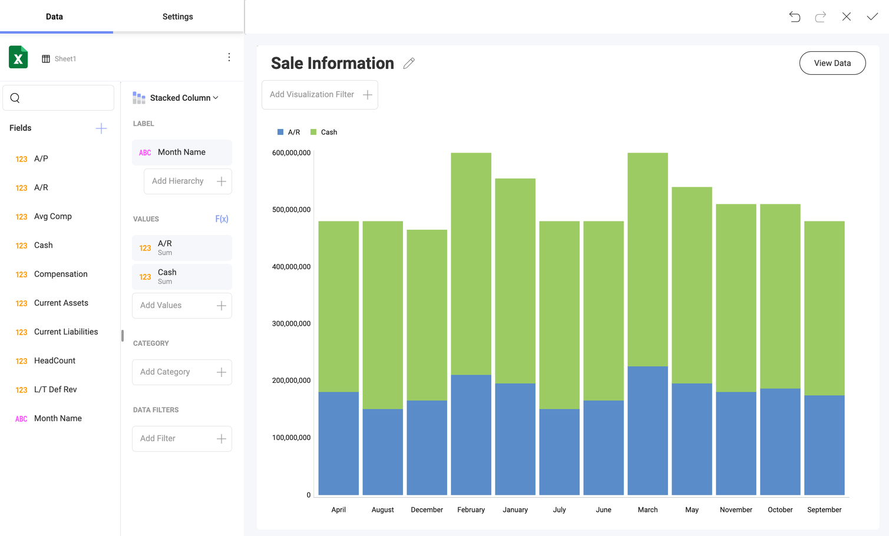
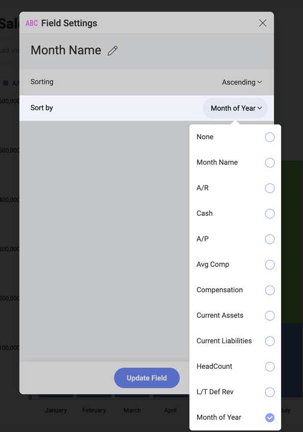
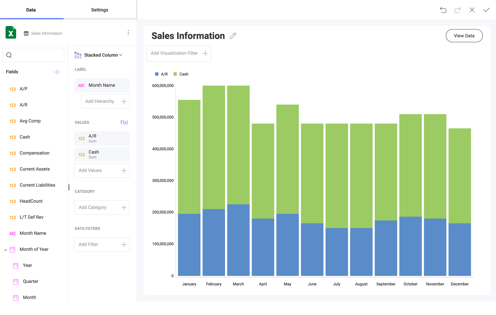

# Sort by Field

Reveal allows you to change how the data in a visualization is displayed by sorting the data in ascending or descending order. In addition, it is
also possible to further control how a visualization looks with sorting by selected fields in your original data source. 

## Enabling Sort by Field 

The *Sort by field* option is part of the fields settings, but is hidden by default. To enable it: 

1. Select a field under the *Label* placeholder. 
2. In *Field Settings*, choose *Ascending* or *Descending* for *Sorting*. 
3. *Sort by field* shows under the *Sorting* setting. You can choose a field from the dropdown on the right (as shown above).
 
For more practical information, take a look at the following examples
that showcase this functionality:

- [Enabling Sort by Field](#enabling-sort-by-field)
- [Ordering Support Cases by Priority](#ordering-support-cases-by-priority)
- [Ordering String Dates in Chronological Order](#ordering-string-dates-in-chronological-order)

## Ordering Support Cases by Priority

There are scenarios where you would like to order a field by using business logic instead of ordering it alphabetically. 
For example, the following is a visualization, which displays new support cases an ascending order.

The *Priority* field is a text field, so it's ordered A-Z by default. However, if we use business logic, *Priority* values should be ordered as follows: *Low* - *Normal* - *High*. To achieve this, you should have a *Priority Level* column in your data set showing the numeric representation of the priority status (see below). 

Organize the information in your chart by priority level without actually
dragging and dropping *Priority Level* field into the data editor by using the
*Sort By* field option.

## Ordering String Dates in Chronological Order

Let's take a look at the following visualization, where we have plotted
the cash and accounts receivable influxes for a company in a [stacked column chart](/docs/user/tutorials-stacked-charts.md#creating-a-stacked-chart).

The values have been ordered by **Month Name** (a string field).
However, the months have been sorted in alphabetical order by default,
so the resulting visualization is not particularly useful for analysis.

You can, however, change how the **Month Name** is displayed by changing
its formatting and choosing to order the information by **Month of
Year**. You might not necessarily want to display the 1-12 numbers in
the Y axis (**Month of Year**), but you still want that order to
prevail. Select the **Month Name** field in the label placeholder of the
data editor, and select your desired sorting.

Once done, select **Update Field**. Your information will now be ordered
in chronological order.

