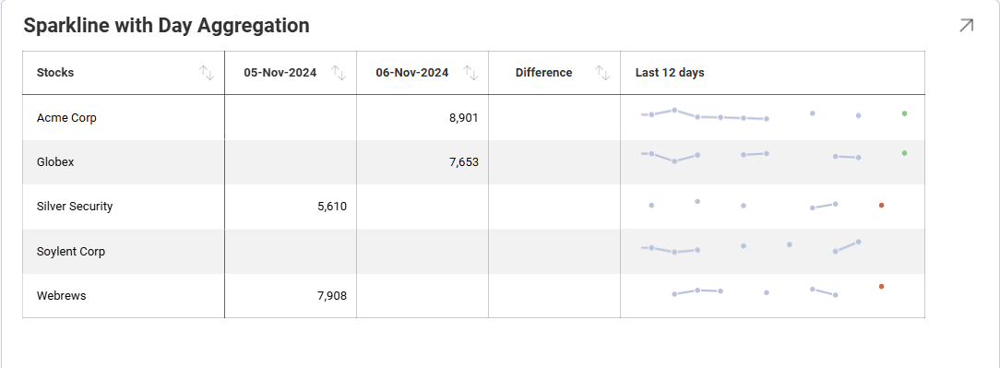
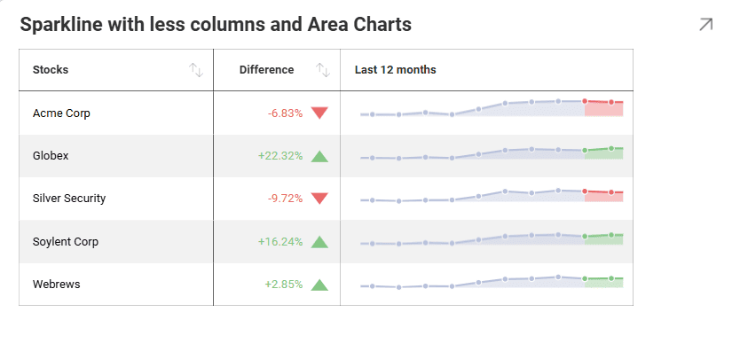
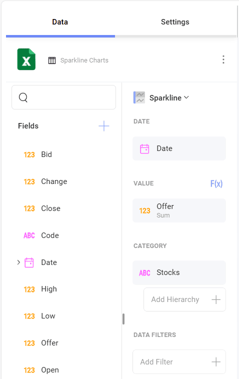
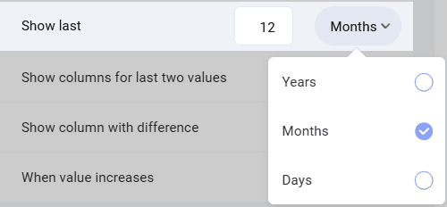
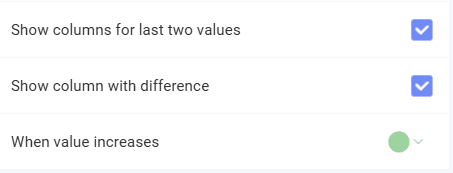

# Creating Sparkline Charts

In this tutorial, you will learn how to create *Sparkline* charts visualizations
using a sample spreadsheet.

Access the links below for the Sparkline chart view walkthroughs:

  - [How to create a Sparkline chart](https://www.slingshotapp.io/en/help/docs/analytics/visualization-tutorials/sparkline-charts#creating-a-sparkline-chart)

  - [How to change the chart type for the Sparkline](https://www.slingshotapp.io/en/help/docs/analytics/visualization-tutorials/sparkline-charts#changing-the-chart-type-for-the-sparkline)

  - [How to change the date aggregation](https://www.slingshotapp.io/en/help/docs/analytics/visualization-tutorials/sparkline-charts#changing-the-date-aggregation)

  - [How to modify the amount of columns in the Sparkline](https://www.slingshotapp.io/en/help/docs/analytics/visualization-tutorials/sparkline-charts#modifying-the-amount-of-columns-in-the-sparkline)

## Key Concepts

Sparkline charts are meant to display trends and their progression in a
given date range. They are particular useful, like OHLC and Candlestick
charts, for financial scenarios and stock movement analysis. Sparklines
display line charts within a grid cell and require:

  - **One field** to be dropped in the **Date** placeholder of the
    data editor.

  - **One field** to be dropped in **Value**.

  - **One field** to be dropped into **Category**.

When working with Sparkline charts, you can add, modify, or remove
information on top of the data you want to display. This comes in the
form of:

  - The **chart type** for your sparkline, which can either be a
    **Line** or **Area** chart.

  - The **aggregation** for the dates in your chart.

  - The **number of values** displayed within that same chart.

  - The explicit information you want to include in your sparkline's
    grid, including whether or not you want to include the **last two
    months in your data and the difference between them**.

## Sample Data Source

For this tutorial, you will use the *Sparkline Charts* sheet
in the [Slingshot Visualization Tutorials](https://download.infragistics.com/slingshot/samples/Slingshot_Visualization_Tutorials.xlsx).

## Creating a Sparkline Chart

1. Select the **+ Dashboard** button in the top right-hand corner of **My Analytics**.

     

2. Select your data source(**Slingshot Tutorials Spreadsheet**) from the list of data sources. If the data source is new, you will need to first add it from the **+ Data Source** button in the top-right corner.

                                            

3. Select the **Sparkline Charts** sheet.

                            

4. Open the *Visualization Picker* and select the **Sparkline Chart**. By default, the visualization type will be set to **Column**.                                                                             
                                                       
  
5. Drag and drop the *Date* field into **Date**, *Offer* into **Value** and *Stocks* into **Category**.

                                                                         

## Changing the Chart Type for the Sparkline

You may want to change the type of chart you want to use for your
sparkline chart. In order to do this:

|                                  |                                                                                        |                                                                     |
| -------------------------------- | -------------------------------------------------------------------------------------- | ------------------------------------------------------------------- |
| 1\. **Access the Settings Menu** |                  | Go to the **Settings** section of the Visualization Editor.         |
| 2\. **Change the Chart Type**    |  | By default, the chart type will be set to line. Set it to **Area**. |

## Changing the Date Aggregation

By default, the aggregation for your information will be **12 months**.
You can change this by modifying the *Show Last* settings. In order to
do so:

|                                  |                                                                                                      |                                                                                                                                                      |
| -------------------------------- | ---------------------------------------------------------------------------------------------------- | ---------------------------------------------------------------------------------------------------------------------------------------------------- |
| 1\. **Access the Settings Menu** |                                | Go to the **Settings** section of the Visualization Editor.                                                                                          |
| 2\. **Change the Aggregation**   |  | By default, the *Show Last* setting will be set to **Months**. Select the dropdown next to *Months* and change the selection to either *Years* or *Days*. |

You can also choose to display more or less data by changing the number
next to the date's aggregation.

## Modifying the amount of columns in the Sparkline

In Slingshot, the amount of columns in the visualization is defined by
whether or not you want to display the last two months and the
difference between them. By default, these will be enabled. In order to
remove them:

|                                      |                                                                                    |                                                                                                                                                          |
| ------------------------------------ | ---------------------------------------------------------------------------------- | -------------------------------------------------------------------------------------------------------------------------------------------------------- |
| 1\. **Access the Settings Menu**     |              | Go to the **Settings** section of the Visualization Editor.                                                                                              |
| 2\. **Change the Displayed Columns** |  | **Uncheck the "Show columns for last two values" or "Show column with difference" boxes** if you do not want to display either of them in the Sparkline. |
