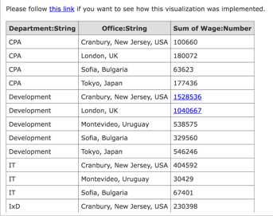
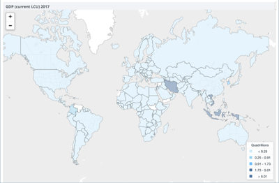
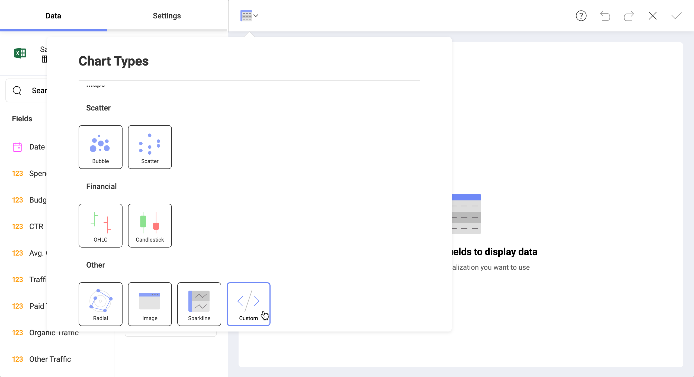

# Custom Visualizations

Analytics offers multiple components for visualizing data, including the grid chart, gauge chart, maps and other chart types. There are some cases, though, where you would like to have another visualization method, not supported out of the box, that you feel would be a better fit for your scenario. It is for these cases that Analytics introduces the ability to do your own custom visualization component and display it in a visualization as part of a Analytics dashboard.

## Sample DIY visualizations

|  Table with custom fonts, titles, and widths |  Choropleth map of the population for United States by state |
|---|---|
|  Choropleth map of the population for Brazil by state |  Choropleth map of worldwide GDP |

## Using a Custom Visualization

1. **Select Custom Visualization.**  
To find this option open the Visualizations section within the Widget Editor.

    

2. **Point to the implementation.**  
Add the URL of the web page that generates the custom visualization you want.

    

    Keep in mind that the URL needs to be publicly accessible and to use the HTTPS:// protocol. In addition, every resource referenced in your custom HTML will need to use the same protocol.

## Custom Web Pages and Analytics
Custom web pages can access the data retrieved by Analytics from any of the supported data sources. The custom visualizations interact with a Javascript API provided for that purpose.

You can reference custom web pages either through a public URL address or from an internal shared location in your intranet.

>[!NOTE]
>**Analytics Web limitations/requirements**
>Analytics web is only able to render custom visualizations that have their components hosted on a public URL.
