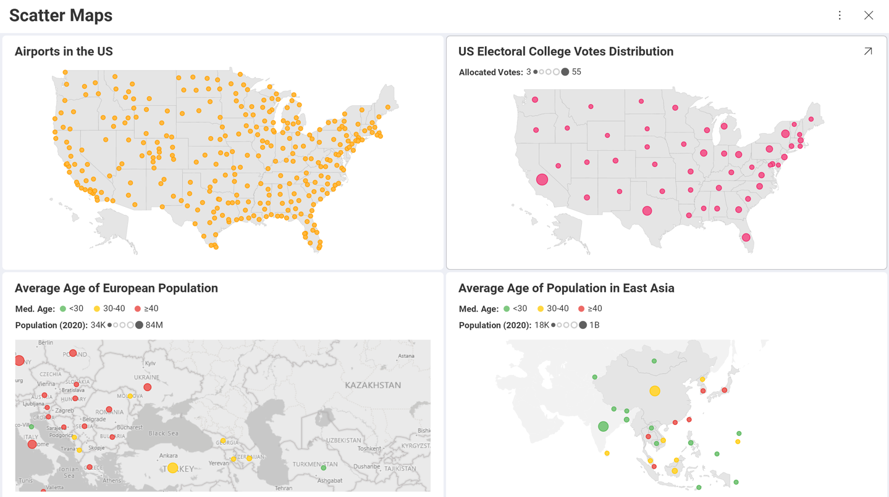
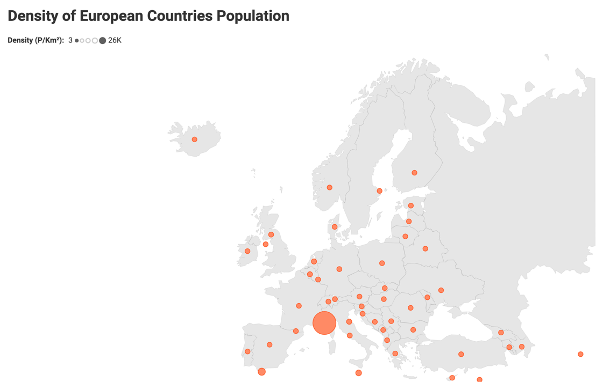
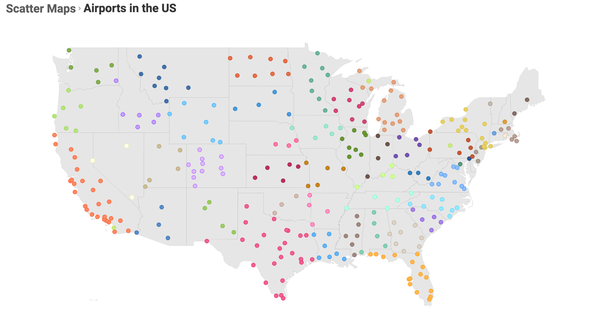
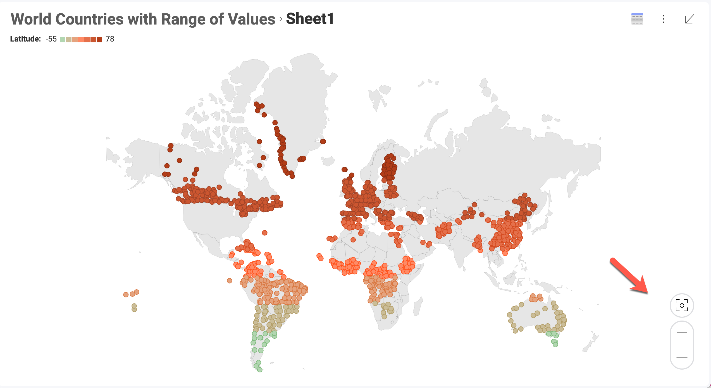
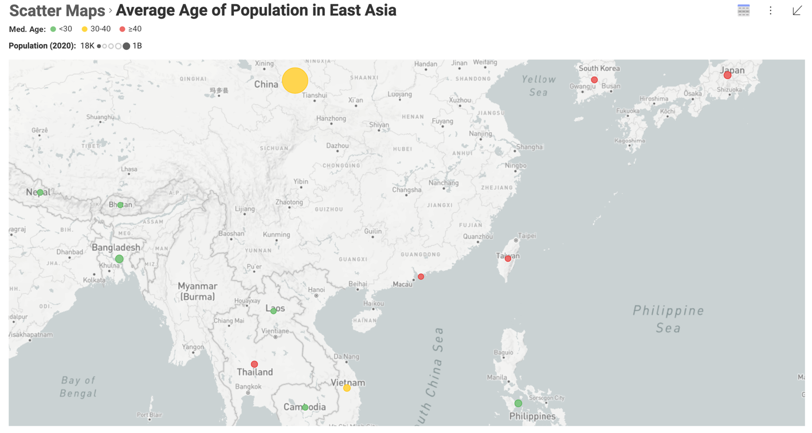
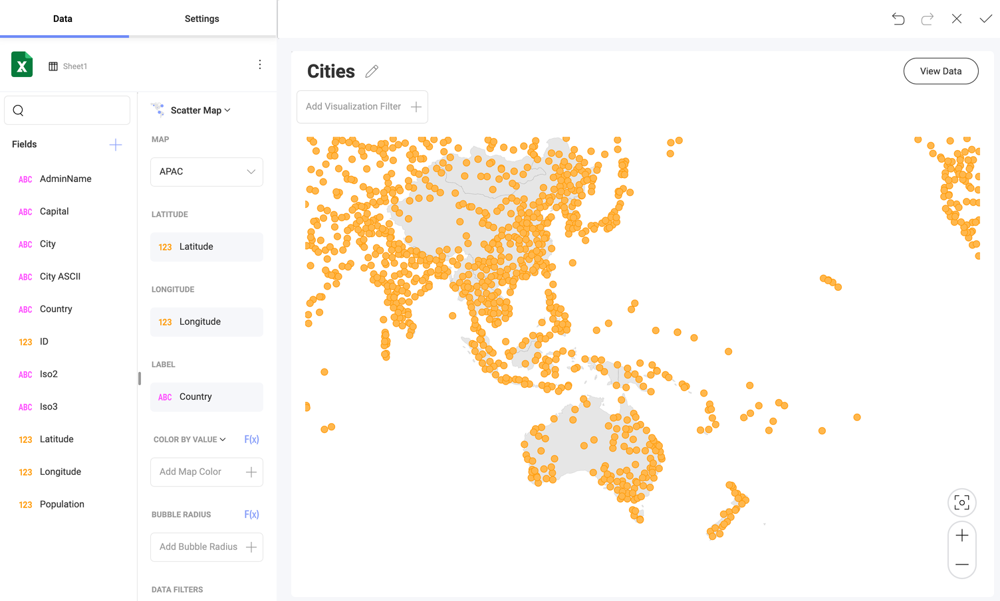
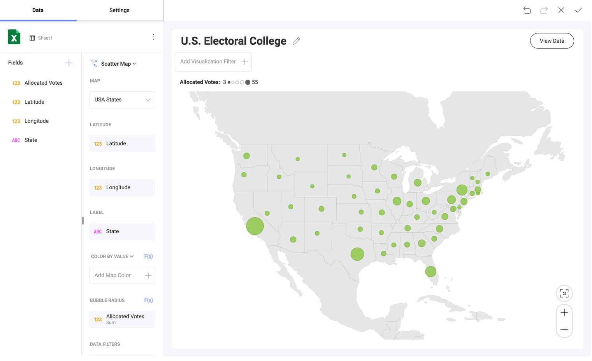
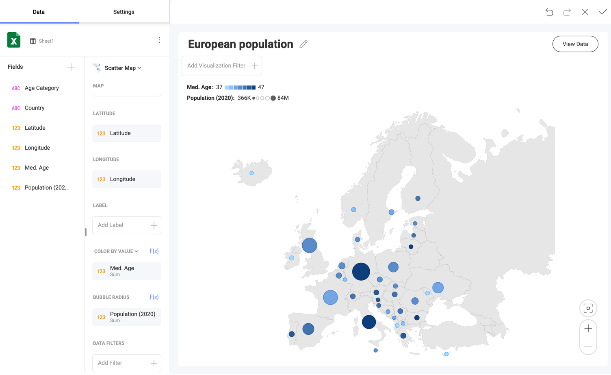

# Scatter Maps

This map displays scattered markers in a geographic area by using geo-coordinates. The visual distribution of markers can help in identifying density and spatial patterns within your data. By adding size and/or color you can reveal more information about your data relative to other points.

Scatter maps give you the possibility to connect to a number of map services, which will not only create a more realistic background for your maps, but will also allow you to delve into details. In some scenarios, like when presenting a real estate market analysis, the ability to show neighborhoods and streets on your map will add more value to your work.

## Using Scatter Maps

The information below will help you choose the best scatter map configuration depending on your needs.

### What are Basic Dot Maps Used for?

The most basic scatter maps in Reveal consist of uniform color dots plotted over a chosen area.

Dot maps are a great way to visualize the geographical distribution of an entity and can reveal patterns when the dots cluster on the map. One dot represents one entity so every single object is depicted on the map using the geo-location in the data set.

One-to-many dot maps are not supported in Reveal. This means, one dot cannot represent more than one object (e.g. 1 dot = 1000 people), so you cannot use the scatter dot maps to create population density maps, for example.  

### What are Bubble Maps Used for?

Adding the size category to your basic scatter map is how bubble maps are created. They are great for
comparing quantitative data in different locations.

Bubbles size indicates the value of a particular variable being compared. To achieve the comparison effect, it would be best if your data set contains a large variety of values for the compared variable. Otherwise, bubbles on the map will appear similar by size (see example below).

Unless you aim to identify and focus on **outliers** (like in the screenshot above), you may need to reconsider your choice of visualization.

Bubbles are not bound to the exact location defined by the latitude and longitude data. Their location is approximate, but the bubbles must appear in the area, for which they carry information. For example, if you want to make a report about the most dangerous neighborhoods across all the US, you will most probably not need the exact location of each crime reported. You will just need to plot the bubbles, sized according to the aggregated crime data, in the correct neighborhoods.

:::note
A potential issue you need to take into account is that overly large bubbles can spread over more than one area. In this case, adding location data to the [bubble tooltip](#bubble-maps) text can help your audience identify the area where the oversize bubble belongs.
:::

### What are Colored Scatter Maps Used for?

Color makes maps easier to perceive and gives you the opportunity to add one more variable to your analysis.

Simple dot maps colored by category are good for drawing attention to clusters and areas where the distribution of an object is really high. For example, you can quickly identify the states with the most airports if the airports in different states are colored differently (see below).

Dot maps colored by value will help you provide insight while avoiding the risk of overlapping large bubbles. If, for example, you aim to make the tendency of the aging population in Europe evident with one look, create a dot map colored by the medium population age and style the color to show low, medium and high average age:

However, if you aim to show the correlation between two  values for individual locations, your purpose will be served by presenting one value with size and the other - with color. Taking the previous example, you can color the dots by population age and size them by GDP of the country to show the correlation between prosperity and higher life expectancy.

## Scatter Maps Zoom

Scatter maps allow you to zoom in and focus on an area, where the markers are more densely plotted, or such that is not part of the _Map_ dropdown (e.g. the Balkan Peninsula). You can even save the zoomed area and keep this view in the dashboard.

When the map is maximized, you can zoom in and out in *Dashboard View mode* or in the *Visualization Editor* too.

When maximized, the scatter map displays a zoom control that allows you to better adjust the zoom level and reset it when needed.

As shown above, there are a couple of buttons displayed at the bottom right of the map. The _Reset Zoom_ button will reset the map zoom to the zoom-level the map was saved the last time.

Zooming also allows you to change the clear shapes Reveal uses as a map background. At a chosen zoom level, you can replace the grey areas with detailed real maps, called *image tiles* provided by one of the following map services:

* *Bing*
* *Esri*
* *Mapbox*

For more information on how to use your map service *authentication token* in Reveal or how to view shared maps using image tiles.

## Creating a Scatter Map

The Scatter Map in Reveal provides you with a variety of opportunities for your geographical analysis based on the data you choose to display.

### Location Data Requirements

The ScatterMap visualization plots the data using geo-coordinates. Each data point requires a latitude and longitude value to be displayed. The accepted format by Reveal is:

* **Two different columns** for latitude and longitude respectively.
* **Latitude/Longitude** in Decimal Degrees format, for example: -46.896388, 168.126111

:::note
**Unaccepted formats**: Latitude/Longitude formats, containing minutes and seconds symbols, such as *46° 53.783333'*, and formats containing suffixes *- 46° 53' 47'' South, 168° 7' 34'' E*, are not accepted.
:::

The ***"There is no data to display."*** message may appear in the Visualization Editor, even if your latitude and longitude data is correct and is in the accepted format. This can happen if the geographic coordinates are plotted outside the bounds of the selected map.

### Basic Dot Maps  

You can create dot maps by using only the *Latitude* and *Longitude* data from your data set. If your data source does not contain these fields, you can add them from another data source.

You also need to choose one of the predefined maps from the *Map* dropdown in the _Scatter Map Data_ section.  

Additionally, the optional Label placeholder can be populated to replace the default tooltip text of latitude and longitude with the associated Label-field value in the data. In the screenshot above, the dots are located on the map based on the airports' addresses, but you can also use the airports' names for the tooltip text.

Because of the conceptual simplicity of this map, you can only choose whether to show *title* and set the *color* of the dots in the _Settings_ section.

### Bubble Maps

You can also create a scatter map with variable-sized markers or bubbles.

Bubble maps are created by using the same data as simple dot maps. Plus, you need to drop a numeric field in the _Bubble Radius_ placeholder.

The tooltip of a bubble includes two parts:

* A bolded title - uses data coming from the field in *Label*.
* Content - consists of the name and value of the field in *Bubble Radius*.

The **bubble tooltips** are used to help your audience read the map. It gives a better idea of what their size stands for and provides the exact value. It can help avoiding the misinterpretation that the bubble is an actual area on the map.

### Adding Color to Scatter Maps

The scatter map allows you to visualize a third variable indicated by color. Adding color is an option for both dot and bubble maps.

Color on the map can be determined by:

* *Value* - it's best to use a numeric data field. If you drop a text field, your data will be automatically aggregated and Reveal will take _Count of Rows_ to determine the color.    

* *Category* - a text field is expected. However, if you provide a numeric field, the values in it will be processed as text, i.e. no aggregation will be applied, and a separate color will be created for each individual value.  

### Configuring Style Settings

Style settings for _Scatter Maps_ include showing/hiding visualizations' *Title* and *Legend* as well as configuring color and type of the markers on the map.

Color settings depend on the scatter map type.

For **basic dot and bubble maps** using uniform colored markers, you can select a color from the 10-color palette in _Start Color_.

For **scatter maps colored by category** you can choose to _Use different markers_. If you enable this function, Reveal will automatically create a unique marker for each category by using combinations between colors and symbols such as squares, triangles, dots, stars, octagons, etc.

For **scatter maps colored by value** you can configure the coloring scheme. You will see three options in the _Color as_ dropdown:

* _Single Color_ - styles all markers on the map with the same color.
* _Range of Values_ - styles the marker using one of seven colors, where colors progressing light to dark represent data values from low to high. You can also choose the _Start Color_, which will determine the color in the middle of the seven shades.
* _Conditional Formatting_ - this scheme allows you to establish styling rules per ranges of data - upper, middle, and lower. Depending on the nature of the information, low values might be a good or bad signal, so you have the flexibility to configure the styling in a way that makes the most sense in your situation.
