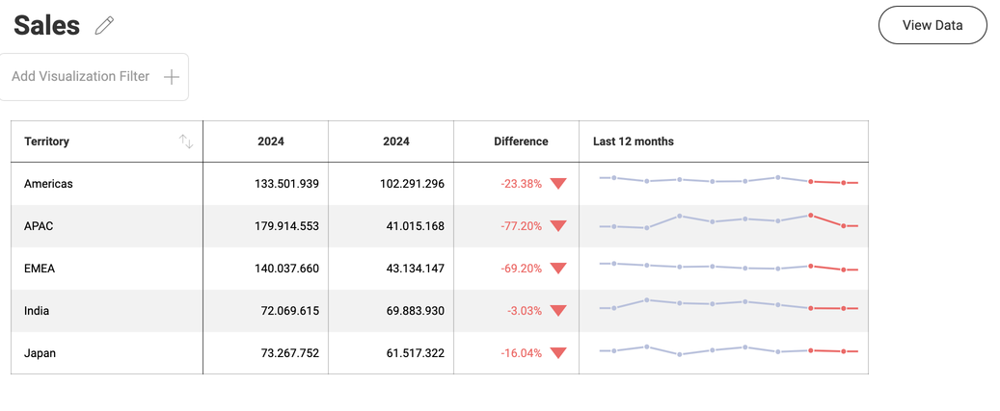
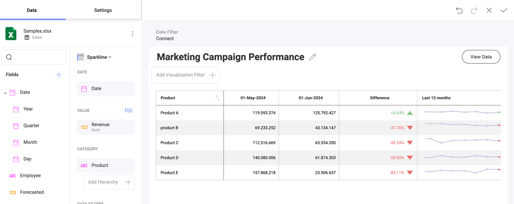
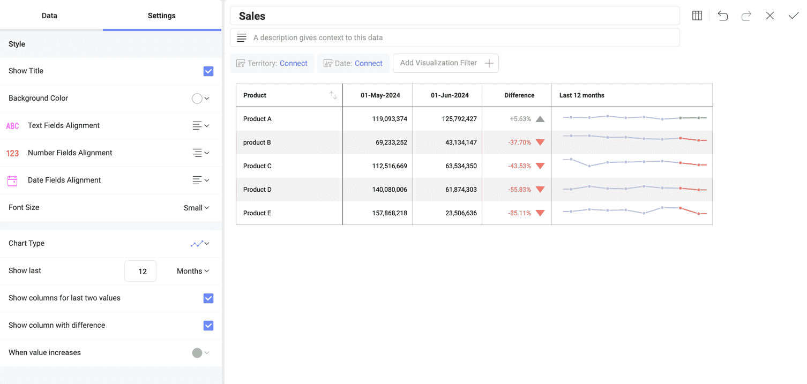

# Sparkline Charts

Sparkline charts are small charts plotted within a grid chart, without
any axes, labels or other chart elements. They are meant to represent
trends and their progression in a given date range.

The first column remains fixed in the Visualization Editor, allowing
you to scroll through the different columns in your information.

## Advanced Sparkline Settings

If you access the **Settings** section of the visualizations editor, you
will be able to modify several settings, including:

  - **Alignment** for texts, numbers, and dates.

  - **Font sizes** for your grid elements.

  - The **type of chart** for your sparkline: line or area charts.

  - The **Aggregation** for your dates.

  - The **number of values** you want to include in the sparkline chart
    within the grid.

  - The **information you want to include in your sparkline columns**,
    including the last two values and the difference between them. In
    addition, you can also choose whether you want to **represent a
    positive difference in green or red**.
