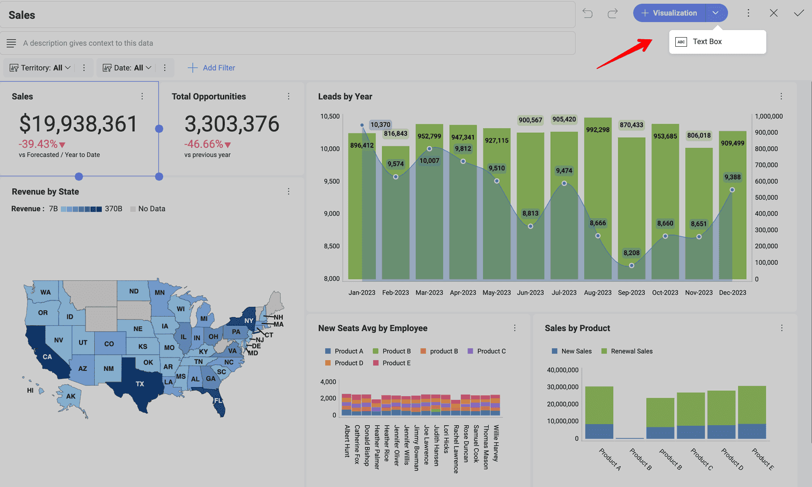

# Text Box Visualization

Text Box visualizations, as their name suggests, consist of a text body
and an optional title. They are not connected to a data source. A common
scenario for using a Text Box is adding a text summary to your report.

## Adding a Text Box to Your Dashboard

To add a Text Box to an existing dashboard, you need to:

1.  Open the dashboard in *Edit mode*.

2.  Click/Tap the arrow on the right of the *+ Visualization* split button and choose **Text Box**.

:::note
When adding a Text box visualization to an existing dashboard, it appears **at the bottom of your dashboard**. You can move it by dragging it.
:::
## Creating a Text Box as a First Visualization in a Dashboard

Sometimes you may want to start your dashboard by creating a Text Box
visualization, showing a summary or brief introduction. To access the
Text Box creation menu, follow the steps below:

1.  Click/Tap the **+ Dashboard** button in the top right corner of the initial screen.

2.  The *New Visualization* dialog opens and prompts you to select a data source. Click/tap on the **X** to close the dialog.

    

3.  Click/tap on the *arrow* of the *+ Visualization* split button and select *Text Box*.

      

## Working With the Text Box Visualization

After choosing to add a new Text Box visualization, the following empty
form appears:

In this dialog you can:

  - Choose between *Small*, *Medium* and *Large* *Text Size*.

  - Select the alignment of the text (next to *Text Size*).

  - Write your own text in the text body (the *Enter text* box).

  - Add a *Title*. (optional)

