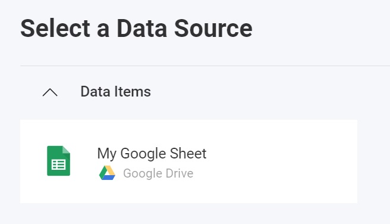

import Tabs from '@theme/Tabs';
import TabItem from '@theme/TabItem';

# Adding a Google Sheet Data Source

**Step 1** - Add an event handler for the `RevealView.onDataSourcesRequested` event.

```js
var revealView = new $.ig.RevealView("#revealView");
revealView.onDataSourcesRequested = (callback) => {
    //add code here
    callback(new $.ig.RevealDataSources([], [], false));
};
```

**Step 2** - In the `RevealView.onDataSourcesRequested` event handler, create a new instance of the [RVGoogleDriveDataSourceItem](https://help.revealbi.io/api/javascript/latest/classes/rvgoogledrivedatasourceitem.html) object. Set the `Identifier` property to the Google Spreadsheet ID.

```js
revealView.onDataSourcesRequested = (callback) => {
    //get file from google drive
    const googleDriveDSI = new $.ig.RVGoogleDriveDataSourceItem();
    googleDriveDSI.identifier = "file_identifier";

    callback(new $.ig.RevealDataSources([], [], false));
};
```

The Google Spreadsheet ID, also known as the `Identifier`, is a unique identifier for each spreadsheet you create in Google Sheets. The easiest way to find the `Identifier` is to look at the URL of the spreadsheet. In the URL, the spreadsheet ID is the string of letters and numbers that comes after the “/d/” portion of the URL.


In this example, the `Identifier` is **1Tv8z8ya_qTfaiRSYv0U_z21nubgzE_-ZskuPbP1VDxA**

**Step 3** - Create a new Google Sheet Data Source Item by creating a new instance of the [RVGoogleSheetDataSourceItem](https://help.revealbi.io/api/javascript/latest/classes/rvgooglesheetdatasourceitem.html) object. Set the `Title`, `Subtitle`, and `Sheet` properties that correspond to your values. After you have created the `RVGoogleSheetDataSourceItem` object, add it to the data source items collection.

```js
revealView.onDataSourcesRequested = (callback) => {
    //get file from google drive
    const googleDriveDSI = new $.ig.RVGoogleDriveDataSourceItem();
    googleDriveDSI.identifier = "file_identifier";

    //indicate the file is a google sheet and set the sheet name
    const googleSheet  = new $.ig.RVGoogleSheetDataSourceItem(googleDriveDSI);
    googleDriveDSI.title = "My Google Sheet";
    googleSheet.subtitle = "Google Drive";
    googleSheet.sheet = "Sheet1";

    callback(new $.ig.RevealDataSources([], [googleSheet], false));
};
```

When the application runs, create a new Visualization and you will see the newly created Google Sheet data source item listed in the "Select a Data Source" dialog.




:::info Get the Code

The source code to this sample can be found on [GitHub](https://github.com/RevealBi/sdk-samples-javascript/tree/main/DataSources/GoogleSheets-ServiceAccount)

:::