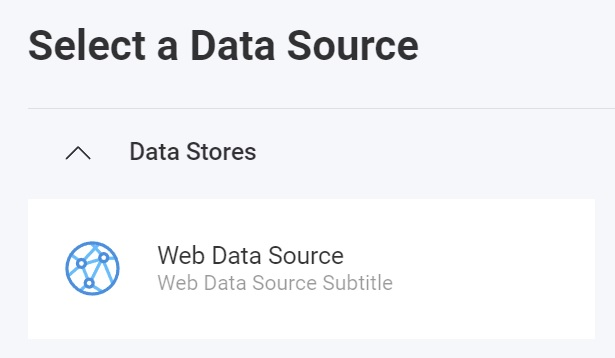

import Tabs from '@theme/Tabs';
import TabItem from '@theme/TabItem';

# Adding a JSON Data Source

:::danger breaking changes

Currently, the Reveal SDK is in the process of decoupling the data sources from the Reveal SDK core package. In order to ensure the project's continued functionality, you might be required to install additional packages into your project. Please see the [Supported Data Sources](web/datasources.md#supported-data-sources) topic for more information.

:::

**Step 1** - Add an event handler for the `RevealView.onDataSourcesRequested` event.

```js
var revealView = new $.ig.RevealView("#revealView");
revealView.onDataSourcesRequested = (callback) => {
    //add code here
    callback(new $.ig.RevealDataSources([], [], false));
};
```

**Step 2** - In the `RevealView.onDataSourcesRequested` event handler, create a new instance of the [RVWebResourceDataSource](https://help.revealbi.io/api/javascript/latest/classes/rvwebresourcedatasource.html) object. Set the `URL` property to the url of the CSV resource, and set the `useAnonymousAuthentication` property to `false` if there is no authentication required to access the CSV resource. Optionally, you can add the `RVWebResourceDataSource` object to the data source collection of the callback to display it in the RevealView's Data Source Dialog.

```js
revealView.onDataSourcesRequested = (callback) => {
    const webDS = new $.ig.RVWebResourceDataSource();
    webDS.title = "Web Data Source";
    webDS.subtitle = "Web Data Source Subtitle";
    webDS.url = "https://excel2json.io/api/share/6e0f06b3-72d3-4fec-7984-08da43f56bb9";
    webDS.useAnonymousAuthentication = true;

    callback(new $.ig.RevealDataSources([webDS], [], false));
};
```

When the application runs, create a new Visualization and you will see the newly created Web Resource data source listed in the "Select a Data Source" dialog.



**Step 3** - To bypass the **Set up your JSON** screen of the data source dialog and use the JSON data directly, create a new instance of the [RVWebResourceDataSourceItem](https://help.revealbi.io/api/javascript/latest/classes/rvwebresourcedatasourceitem.html), and pass the `RVWebResourceDataSource` object created in the previous step as a constructor argument. Next, create a new instance of the [RVJsonDataSourceItem](https://help.revealbi.io/api/javascript/latest/classes/rvjsondatasourceitem.html) and pass the `RVWebResourceDataSourceItem` as the contructor argument. Set the `Title` and `Subtitle` properties. Finally, you **MUST** set the `Config` property to a JSON string that represents the structure of the data. To make this process easier, you can use the [RVJsonSchemaConfigBuilder](https://help.revealbi.io/api/javascript/latest/classes/rvjsonschemaconfigbuilder.html) class to help build the JSON structure using a fluent API.

After you have created the `RVJsonDataSourceItem` object, add it to the data source items collection.

```js
revealView.onDataSourcesRequested = (callback) => {
    const webDS = new $.ig.RVWebResourceDataSource();
    webDS.title = "Web Data Source";
    webDS.subtitle = "Web Data Source Subtitle";
    webDS.url = "https://raw.githubusercontent.com/fivethirtyeight/data/master/airline-safety/airline-safety.csv";
    webDS.useAnonymousAuthentication = true;

    //to skip the "Set up your JSON" dialog and directly use the JSON data
    const webDSI = new $.ig.RVWebResourceDataSourceItem(webDS);
    const jsonDSI = new $.ig.RVJsonDataSourceItem(webDSI);
    jsonDSI.title = "Sales by Category";
    jsonDSI.subtitle = "Excel2Json";
    jsonDSI.config = new $.ig.RVJsonSchemaConfigBuilder()
        .addNumericField("CategoryID")
        .addStringField("CategoryName")
        .addStringField("ProductName")
        .addNumericField("ProductSales")
        .build();

    callback(new $.ig.RevealDataSources([webDS], [jsonDSI], false));
};
```

When the application runs, create a new Visualization and you will see the newly created JSON data source item listed in the "Select a Data Source" dialog.


# Working with nested properties

In JSON, data is organized hierarchically, often featuring nested structures where objects contain other objects or arrays. To navigate these structures programmatically, you can specify nested properties, which are essentially a sequence of keys or indices that lead to the desired data.
```js
const jsonDsItem = new $.ig.RVJsonDataSourceItem(dsItem);
jsonDsItem.config = new RevealApi.RVJsonSchemaConfigBuilder()
        .addStringField("fieldA")
        .addNumericField("fieldB")
        .addNumericField("/geo/location/lat")
        .addNumericField("/geo/location/lng")
        .setIterationDepth(0)
        .build();
```

:::info Get the Code

The source code to this sample can be found on [GitHub](https://github.com/RevealBi/sdk-samples-javascript/tree/main/DataSources/Json)

:::