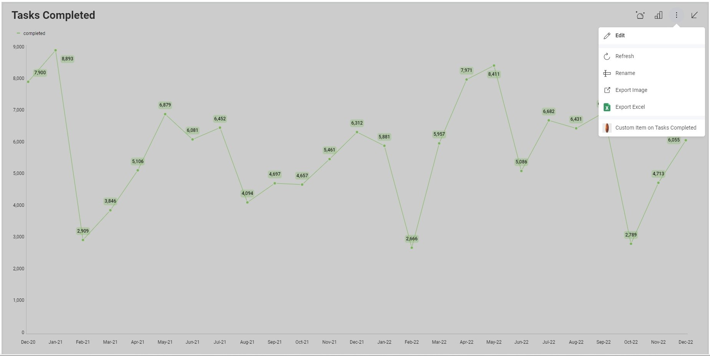

# Custom Menu Items

The Reveal SDK supports adding Custom Menu Items, enabling users to modify the behavior of the contextual menu in dashboards and visualizations. By adding custom menu items, users can incorporate their own functionality into the menu.

To manipulate the menu, you should add an event handler for the `revealView.onMenuOpening` event on the client.

```js
const revealView = new $.ig.RevealView("#revealView");

revealView.onMenuOpening = function (visualization, args) {
    ...
};
```

## Example: Creating a Custom Menu Item

**Step 1** - Add an event handler for the `revealView.onMenuOpening` event on the client.

**Step 2** - Create a new instance of the class `RVMenuItem` and push it to the `args.menuItems` array. The callback specified in the `RVMenuItem` will be called when clicked.

```js
const revealView = new $.ig.RevealView("#revealView");
revealView.onMenuOpening = function (visualization, args) {
    //adding a new menu item
    const menuItem = new $.ig.RVMenuItem("Custom Item 3", new $.ig.RVImage("https://i.pinimg.com/736x/03/c8/a2/03c8a2aff8be6bee9064eef9b5d72d66.jpg", "Icon"), () => {
        alert('my action');
    })
    args.menuItems.push(menuItem);
};
```



## Example: Hiding a predefined Menu Item

**Step 1** - Add an event handler for the `revealView.onMenuOpening` event on the client.

**Step 2** - In the `args.menuItems` array, locate the element you want to hide and set its `isHidden` property to `true`.

```js
revealView.onMenuOpening = function (visualization, args) {
    //hiding a menu item
    for (let i = 0; i < args.menuItems.length; i++) {
        if(args.menuItems[i].title === "Export") args.menuItems[i].isHidden = true;
    }
};
```


:::info Get the Code

The source code to this sample can be found on [GitHub](https://github.com/RevealBi/sdk-samples-javascript/tree/main/CustomMenuItems)

:::