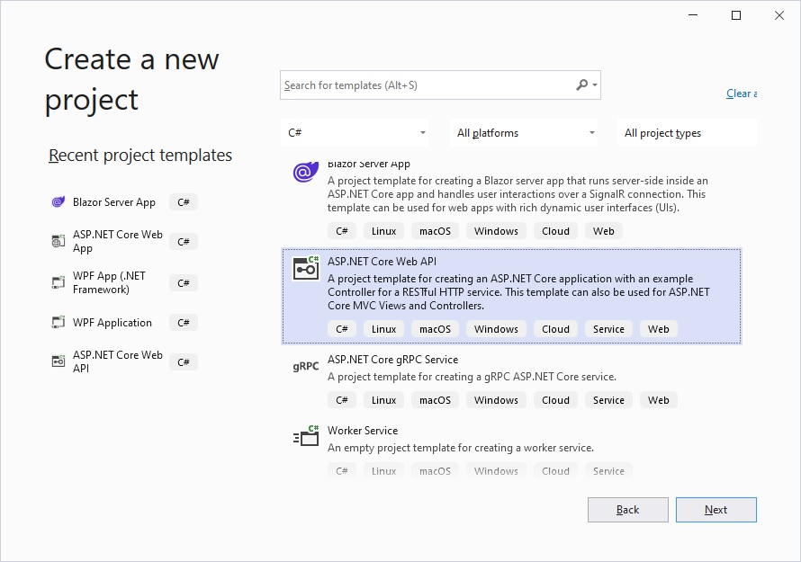
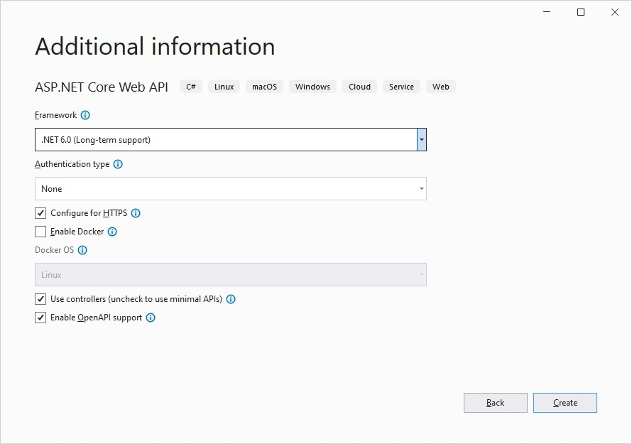
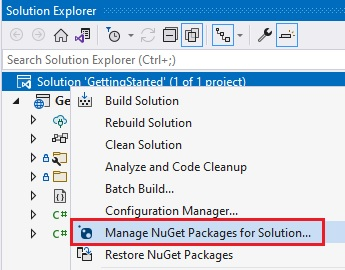
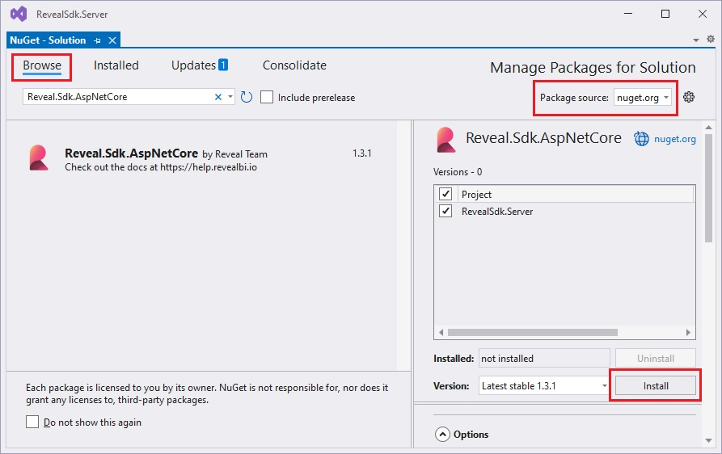

# Setting up the Reveal SDK Server with ASP.NET

## Step 1 - Create a New ASP.NET Core Web API

The steps below describe how to create a new ASP.NET Core Web API project. If you want to add the Reveal SDK to an existing application, go to Step 2.

1 - Start Visual Studio and click **Create a new project** on the start page, select the **ASP.NET Core Web API** template, and click **Next**.



2 - Provide a project name and set the location to the **server** directory we created earlier, and click **Next**.


3 - Choose your framework, authentication type, and Docker options, and then click **Create**.



## Step 2 - Add Reveal SDK

1 - Right click the Solution, or Project, and select **Manage NuGet Packages** for Solution.



2 - In the package manager dialog, open the **Browse** tab, select the **Infragistics (Local)** package source, and install the **Reveal.Sdk.AspNetCore** NuGet package into the project.



:::info

If you are a trial user, you can install the **Reveal.Sdk.Web.AspNetCore.Trial** NuGet package found on [NuGet.org](https://www.nuget.org/packages/Reveal.Sdk.Web.AspNetCore.Trial/).

:::

3 - Open and modify the `Program.cs` file to add the namespace `using Reveal.Sdk;`. Then, add the call to `IMcvBuilder.AddReveal()` to the existing `builder.Services.AddControllers()` method as follows:

```cs
using Reveal.Sdk;

builder.Services.AddControllers().AddReveal();
```

## Step 3 - Create the Dashboards Folder

1 - Right-click the project and select **Add -> New Folder**. The folder MUST be named **Dashboards** .


By default, the Reveal SDK uses a convention that will load all dashboards from the **Dashboards** folder. You can change this convention by creating a custom `IRVDashboardProvider`. You can learn more about this in the [Loading Dashboards](loading-dashboards.md) topic.


## Step 4 - Setup CORs Policy (Debugging)

While developing and debugging your application, it is common to host the server and client app on different URLs. For example; your Server my be running on `https://localhost:24519`, while your Angular app may be running on `https://localhost:4200`. If you were to try and load a dashboard from the client application, it would fail because of ASP.NET Core's Cross-Origin Requests (CORs) security policy. To enable this scenario, you must create a CORs policy and enable it in the server project.

1 - Open and modify the `Program.cs` file to create a CORs policy which will allow any origin (url) access to any headers and methods.

```cs
builder.Services.AddCors(options =>
{
  options.AddPolicy("AllowAll",
    builder => builder.AllowAnyOrigin().AllowAnyHeader().AllowAnyMethod()
  );
});
```

2 - Apply the policy only while in debug mode. If you have a production application then you would apply the appropriate policy for your production builds.

```cs
if (app.Environment.IsDevelopment())
{
    app.UseCors("AllowAll");
}
```

It's important to understand the order in which the middleware executes. The `UseCors` must be called in a specific order. In this example after `UseHttpsRedirection()` and before `UseAuthorization()`. For more information, please refer to this [Microsoft help topic](https://docs.microsoft.com/en-us/aspnet/core/security/cors?view=aspnetcore-6.0)

:::info Get the Code

The source code to this sample can be found on [GitHub](https://github.com/RevealBi/sdk-samples-javascript/tree/main/01-GettingStarted/server/aspnet).

:::