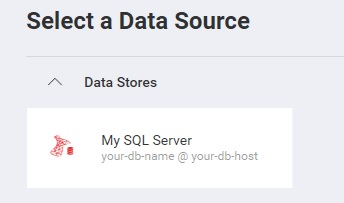
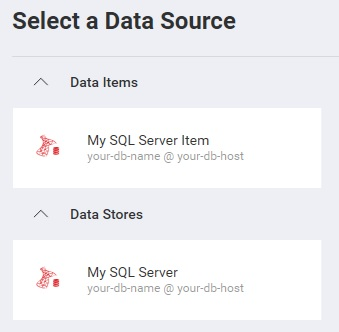

# Adding an MS SQL Server Data Source

**Step 1** - Add an event handler for the `RevealView.onDataSourcesRequested` event.

First define a `<div>` tag with the `id` set to `revealView`.

```html
<div id="revealView" style="height: 920px; width: 100%;"></div>
```

Initialize the `revealView` and add the event handler.

```javascript
var revealView = new $.ig.RevealView("#revealView");
revealView.onDataSourcesRequested = (callback) => {
    //add code here
    callback(new $.ig.RevealDataSources([], [], true));
};
```

**Step 2** - In the `RevealView.onDataSourcesRequested` event handler, create a new instance of the `RVSqlServerDataSource` object. Set the `Host`, `Database`, `Port`, and `Title` properties to values that correspond to your MS SQL Server. After you have created the `RVSqlServerDataSource` object, add it to the data sources collection.

```javascript
revealView.onDataSourcesRequested = (callback) => {
    var sqlDataSource = new $.ig.RVSqlServerDataSource();
    sqlDataSource.host = "your-db-host";
    sqlDataSource.database = "your-db-name";
    sqlDataSource.port = 1234;
    sqlDataSource.title = "My SQL Server";

    callback(new $.ig.RevealDataSources([sqlDataSource], [], true));
};
```

When the application runs, create a new Visualization and you will see the newly created MS SQL Server data source listed in the "Select a Data Source" dialog.



**Step 3** - Add a new Data Source Item by creating a new instance of the `RVSqlServerDataSourceItem` object. Set the `Id`,`Title`, and `Table` properties that correspond to your database table. After you have created the `RVSqlServerDataSourceItem` object, add it to the data source items collection.

```javascript
revealView.onDataSourcesRequested = (callback) => {
    var sqlDataSource = new $.ig.RVSqlServerDataSource();
    sqlDataSource.host = "your-db-host";
    sqlDataSource.database = "your-db-name";
    sqlDataSource.port = 1234;
    sqlDataSource.title = "My SQL Server";

    var sqlServerDsi = new $.ig.RVSqlServerDataSourceItem(sqlDataSource);
    sqlServerDsi.id = "MyCustomId";
    sqlServerDsi.title = "My SQL Server Item";
    sqlServerDsi.table = "TableName";    

    callback(new $.ig.RevealDataSources([sqlDataSource], [sqlServerDsi], true));
};
```

When the application runs, create a new Visualization and you will see the newly created MS SQL Server data source item listed in the "Select a Data Source" dialog.



> [!IMPORTANT]
> Calling the `$.ig.RevealSdkSettings.setBaseUrl` is required when the server is running on a different URL than the client application. If both the server application and the client application are running on the same URL, this method is not required. This method only needs to be called once.
