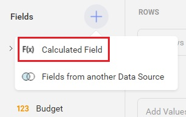
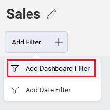
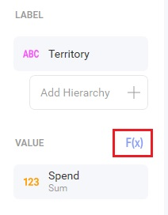
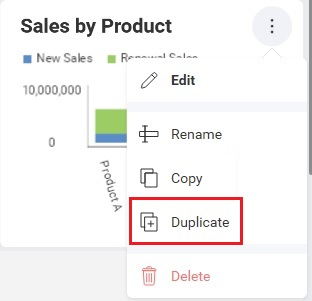
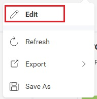
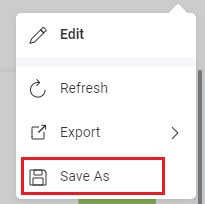
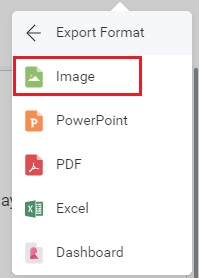
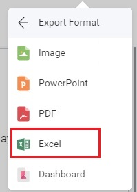
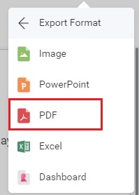
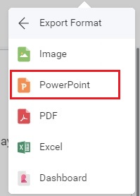

# Editing Dashboards

While editing dashboards is primarily an end-user function, there are a number of APIs available to help developers respond to different editing events, control the editing experience by showing/hiding UI elements, or disable editing altogether.

## Properties

### availableChartTypes

This property is used to define which chart types are available to end-users for creating and editing visualizations.


Only the chart types in the `RevealView.availableChartTypes` collection will be displayed to the end-user.

By default, all supported chart types are available.

Sometimes, when working with a small number of chart types, it's easier to remove all chart types and add only the charts you wish to make available. To do this, set the `RevealView.AvailableChartTypes` property to an array containing only the chart types you want to make available to your users.

```javascript
revealView.availableChartTypes = [$.ig.RVChartType.BarChart, $.ig.RVChartType.ColumnChart];
```

To remove specific chart types from the `RevealView.availableChartTypes`, you can use code similar to this example where we remove the `RVChartType.AreaChart`, `RVChartType.Indicator`, and `RVChartType.IndicatorTarget` (also known as KPIs) from the `RevealView.AvailableChartTypes`.

```javascript
var chartTypesToRemove = [$.ig.RVChartType.AreaChart, $.ig.RVChartType.Indicator, $.ig.RVChartType.IndicatorTarget];
revealView.availableChartTypes = revealView.availableChartTypes.filter(t => !chartTypesToRemove.includes(t));
```

The `RVChartType` enum has The following values:
- AreaChart
- BarChart
- BubbleChart
- BulletGraph
- CandlestickChart
- Choropleth
- ColumnChart
- ComboChart
- DIY
- DoughnutChart
- FunnelChart
- Grid
- Image
- Indicator
- IndicatorTarget
- LabelGauge
- LineChart
- LinearGauge
- OHLC_Chart
- PieChart
- Pivot
- RadialGauge
- RadialLineChart
- ScatterChart
- ScatterMap
- ScriptPython
- ScriptR
- Sparkline
- SplineChart
- SplineAreaChart
- StackedAreaChart
- StackedBarChart
- StackedColumnChart
- StepAreaChart
- StepLineChart
- TextBox
- TextView  
- TimeSeriesChart
- TreeMap

> [!NOTE]
> If you invoke the `AvailableChartTypes.Clear` method, but do not add any chart types to the collection, then all supported chart types will still be available.

### canAddCalculatedFields

This property shows/hides the **Calculated Field** menu item for the Visualization Editor.



```javascript
revealView.canAddCalculatedFields = false;
```

### canAddDashboardFilter

This property shows/hides the **Add Dashboard Filter** menu item for the Dashboard.



```javascript
revealView.canAddDashboardFilter = false;
```

### canAddDateFilter

This property shows/hides the **Add Date Filter** menu item for the Dashboard.


```javascript
revealView.canAddDateFilter = false;
```

### canAddPostCalculatedFields

This property shows/hides the **F(x)** menu item in the "Visualization Fields" section of the Visualization Editor.



```javascript
revealView.canAddPostCalculatedFields = false;
```

### canAddVisualization

This property shows/hides the dashboard's **+ Visualization** button when in edit mode.

```javascript
revealView.canAddVisualization = false;
```

### canChangeVisualizationBackgroundColor

This property enables the ability to provide a background color for a visualization in the **Settings** tab of the visualization editor.


```javascript
revealView.canChangeVisualizationBackgroundColor = true;
```

When using this property, you must install the following dependencies into your client application:

- Spectrum v 1.8.0 or newer

``` html
<link href="https://cdnjs.cloudflare.com/ajax/libs/spectrum/1.8.0/spectrum.min.css" rel="stylesheet" type="text/css" >
<script src="https://cdnjs.cloudflare.com/ajax/libs/spectrum/1.8.0/spectrum.min.js"></script>
```

### canCopyVisualization

This property shows/hides the **Copy** menu item for a Visualization.


```javascript
revealView.canCopyVisualization = false;
```

### canDuplicateVisualization

This property shows/hides the **Duplicate** menu item for a Visualization.



```javascript
revealView.canDuplicateVisualization = false;
```

### canEdit

This property shows/hides the **Edit** menu item for the Dashboard.



```javascript
revealView.canEdit = false;
```

When the `RevealView.canEdit` property is set to `false`, dashboard editing is completely disabled.

### canMaximizeVisualization

This property show/hides the **Maximize** button on a visualization.


```javascript
revealView.canMaximizeVisualization = false;
```

### canSaveAs

This property shows/hides the **Save As** button in the dashboard menu.



```javascript
revealView.canSaveAs = false;
```

### showChangeDataSource

This property shows/hides the **Change Data Source** button on the Data tab in the visualization editor.


```javascript
revealView.showChangeDataSource = false;
```

### showEditDataSource

This property shows/hides the **Edit** menu item for the DataSource in the Visualization Editor.


```javascript
revealView.showEditDataSource = false;
```

### showExportImage

This property shows/hides the **Image** item from the export menu.



```javascript
revealView.showExportImage = false;
```

### showExportToExcel

This property shows/hides the **Excel** item from the export menu.



```javascript
revealView.showExportToExcel = false;
```

### showExportToPDF

This property shows/hides the **PDF** item from the export menu.



```javascript
revealView.showExportToPDF = false;
```

### showExportToPowerPoint

This property shows/hides the **PowerPoint** item from the export menu.



```javascript
revealView.showExportToPowerPoint = false;
```

### showFilters

This property shows/hides the dashboard filters.


```javascript
revealView.showFilters = false;
```

### showHeader

This property shows/hides the entire dashboard header, which include the dashboard Title and the dashboard menu

```javascript
revealView.showHeader = false;
```

### showMenu

This property shows/hides the dashboard menu that is placed in the top right corner of the `RevealView`

```javascript
revealView.showMenu = false;
```

### showRefresh

This property shows/hides the **Refresh** button from the dashboard menu.


```javascript
revealView.showRefresh = false;
```

### startInEditMode

When set to `true`, this property will place the `RevealView` into "Edit Mode" when a dashboard is first loaded.


```javascript
revealView.startInEditMode = false;
```

### startWithNewVisualization

When set to `true`, this property will immediately launch the "New Visualization" dialog prompting you to choose a data source.


```javascript
revealView.startWithNewVisualization = false;
```

> [!NOTE]
> This property will not function if you are loading an existing dashboard and have not set the `RevealView.startInEditMode` property to `true` 

## Events

### onVisualizationEditorOpening

There may be times when you want to execute some application logic **before** the visualization editor has opened, and you may want to even prevent the editor from opening until a condition is met. To do this, you can add an event handler to the `RevealView.onVisualizationEditorOpening` event.

```javascript
revealView.onVisualizationEditorOpening = function (args) {
    if(args.isNewVisualization == false){ //the user is trying to edit an existing visualization
        args.cancel = true; //prevent it
    }
};
```

The `VisualizationEditorOpeningArgs` contains the following properties:
- **cancel** - gets or sets a value indicating whether the event should be canceled. `true` if the event should be canceled; otherwise `false`
- **isNewVisualization** - if `true`, the visualization is a newly added visualization. If `false`, it is an existing visualization
- **visualization** - the visualization that was edited and/or added

> [!NOTE]
> If you set `VisualizationEditorOpeningArgs.cancel` to `true`, then the Visualization Editor will not open.

### onVisualizationEditorOpened

If you would like to be notified **after** the Visualization Editor has been opened, either when editing an existing visualization or creating a new one, you can add an event handler to the `RevealView.onVisualizationEditorOpened` event.

```javascript
revealView.onVisualizationEditorOpened = function (args) {
    if(args.isNewVisualization == false) { 
        //the user is editing an existing visualization
    }
};
```

The `VisualizationEditorOpenedEventArgs` contains the following properties:
- **isNewVisualization** - if `true`, the visualization is a newly added visualization. If `false`, it is an existing visualization
- **visualization** - the visualization that was edited and/or added

### onVisualizationEditorClosing

There may be times when you want to execute some application logic **before** the visualization editor has closed, and you may want to even prevent the editor from closing until a condition is met. To do this, you can add an event handler to the `RevealView.onVisualizationEditorClosing` event.

```javascript
revealView.onVisualizationEditorClosing = function (args) {
    if(args.isNewVisualization == false) {  //the user is editing
         args.resetVisualization = true; //puts the widget to the state when it was when the user started editing it
    }
};
```

The `VisualizationEditorClosingArgs` contains the following properties:
- **cancel** - gets or sets a value indicating whether the event should be canceled. `true` if the event should be canceled; otherwise `false`
- **isNewVisualization** - if `true`, the visualization is a newly added visualization. If `false`, it is an existing visualization
- **resetVisualization** - if `true`, resets the visualization back to the state prior to being edited.
- **visualization** - the visualization that was edited and/or added

> [!NOTE]
<<<<<<< HEAD:en/javascript/editing-dashboards.md
> If you set `e.cancel` to `true`, then the Visualization Editor will not close.
=======
> If you set `VisualizationEditorClosingArgs.cancel` to `true`, then the Visualzation Editor will not close.
>>>>>>> master:en/web/editing-dashboards.md

### onVisualizationEditorClosed
Anytime an end-user edits a single visualization in the `RevealView`, the `RevealView.onVisualizationEditorClosed` event is fired **after** the editor is closed. This can be in response to editing an existing visualization, or adding a new visualization. You can respond to this event by adding an event handler to the `RevealView.onVisualizationEditorClosed` event.

```javascript
revealView.onVisualizationEditorClosed = function (args) {
    if(args.isNewVisualization == false) { 
    }
};
```

The `VisualizationEditorClosedEventArgs` contains the following properties:
- **isCancelled** - determines if the visualization editor was closed via the **X button** (`false`) or the **Check Button** (`true`)
- **isNewVisualization** - if `true`, the visualization is a newly added visualization. If `false`, it is an existing visualization
- **visualization** - the visualization that was edited and/or added
