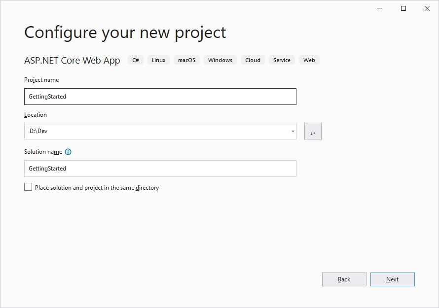
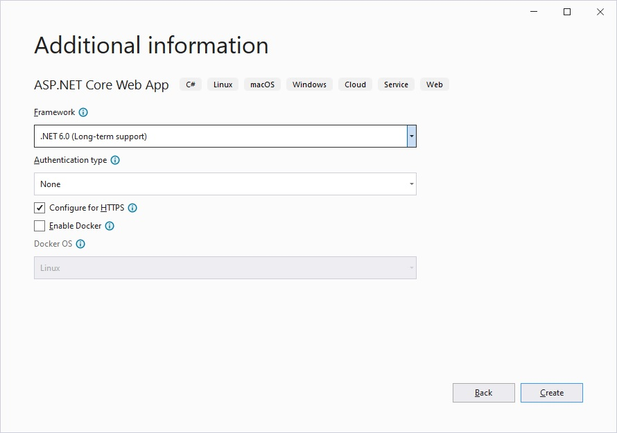
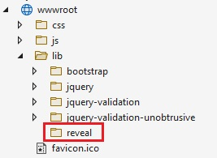

# Getting Started with Reveal SDK for ASP.NET

## Step 1 - Create a New ASP.NET Web App

The steps below describe how to create a new ASP.NET Core Web App project. If you want to add the Reveal SDK to an existing application, go to Step 2.

1 - Start Visual Studio 2019 and click **Create a new project** on the start page, select the **ASP.NET Core Web App** template, and click **Next**.


2 - Provide a project name and location, and click **Next**.



3 - Choose your framework, authentication type, and Docker options, and then click **Create**.



## Step 2 - Add Reveal SDK

1 - Right click the Solution, or Project, and select **Manage NuGet Packages** for Solution.


2 - In the package manager dialog, open the **Browse** tab and install the **Reveal.Sdk.AspNetCore** NuGet package into the project, found on [NuGet.org](https://www.nuget.org/packages/Reveal.Sdk.AspNetCore/).


3 - Open and modify the `Program.cs` file to add the namespace `using Reveal.Sdk;`. Then, add the call to `IMcvBuilder.AddReveal()` as follows:

```
using Reveal.Sdk;

builder.Services.AddRazorPages().AddReveal();
```

## Step 3 - Add Reveal JavaScript API

1 - Create a new folder called `reveal` under the `wwwroot/lib` folder.



2 - Copy all the JavaScript files located at `%public%/Documents/Infragistics/Reveal/SDK/Web/JS/Client` into the `wwwroot/lib/reveal` folder you created previously.


3 - Open and modify the `Pages/Shared/_Layout.cshtml` file to include the `infragistics.reveal.js` script at the bottom of the page just before the closing `</body>` tag, but after the `jquery.min.js` script.

```
<script src="~/lib/reveal/infragistics.reveal.js"></script>
```

> [!NOTE]
> The Reveal JavaScript API depends on `jQuery` version 2.2 or greater.

4 - Install the remaining Reveal JavaScript API dependencies:

- Day.js 1.8.15 or greater

```html
<script src="https://unpkg.com/dayjs@1.8.21/dayjs.min.js"></script>
```

- Quill RTE 1.3.6 or greater

```html
<link href="https://cdn.quilljs.com/1.3.6/quill.snow.css" rel="stylesheet" type="text/css">    
<script src="https://cdn.quilljs.com/1.3.6/quill.min.js"></script>
```

- Spectrum v 1.8.0 or newer (Optional) - this is only needed if you enable the UI for the end user to set the background color for a particular visualization.

``` html
<link href="https://cdnjs.cloudflare.com/ajax/libs/spectrum/1.8.0/spectrum.min.css" rel="stylesheet" type="text/css" >
<script src="https://cdnjs.cloudflare.com/ajax/libs/spectrum/1.8.0/spectrum.min.js"></script>
```

The final `_Layout.cshtml` files should look similar to this:

```html
<!DOCTYPE html>
<html lang="en">
<head>
    <meta charset="utf-8" />
    <meta name="viewport" content="width=device-width, initial-scale=1.0" />
    <title>@ViewData["Title"] - GettingStarted</title>
    <link rel="stylesheet" href="~/lib/bootstrap/dist/css/bootstrap.min.css" />
    <link rel="stylesheet" href="~/css/site.css" asp-append-version="true" />
    <link rel="stylesheet" href="~/GettingStarted.styles.css" asp-append-version="true" />
    <link href="https://cdn.quilljs.com/1.3.6/quill.snow.css" rel="stylesheet" type="text/css">   
</head>
<body>
    <header>
        <nav class="navbar navbar-expand-sm navbar-toggleable-sm navbar-light bg-white border-bottom box-shadow mb-3">
            <div class="container">
                <a class="navbar-brand" asp-area="" asp-page="/Index">GettingStarted</a>
                <button class="navbar-toggler" type="button" data-bs-toggle="collapse" data-bs-target=".navbar-collapse" aria-controls="navbarSupportedContent"
                        aria-expanded="false" aria-label="Toggle navigation">
                    <span class="navbar-toggler-icon"></span>
                </button>
                <div class="navbar-collapse collapse d-sm-inline-flex justify-content-between">
                    <ul class="navbar-nav flex-grow-1">
                        <li class="nav-item">
                            <a class="nav-link text-dark" asp-area="" asp-page="/Index">Home</a>
                        </li>
                        <li class="nav-item">
                            <a class="nav-link text-dark" asp-area="" asp-page="/Privacy">Privacy</a>
                        </li>
                    </ul>
                </div>
            </div>
        </nav>
    </header>
    <div class="container">
        <main role="main" class="pb-3">
            @RenderBody()
        </main>
    </div>

    <footer class="border-top footer text-muted">
        <div class="container">
            &copy; 2022 - GettingStarted - <a asp-area="" asp-page="/Privacy">Privacy</a>
        </div>
    </footer>

    <script src="~/lib/jquery/dist/jquery.min.js"></script>
    <script src="~/lib/bootstrap/dist/js/bootstrap.bundle.min.js"></script>
    <script src="~/js/site.js" asp-append-version="true"></script>

    <script src="https://unpkg.com/dayjs@1.8.21/dayjs.min.js"></script>
    <script src="https://cdn.quilljs.com/1.3.6/quill.min.js"></script>
    <script src="~/lib/reveal/infragistics.reveal.js"></script>

    @await RenderSectionAsync("Scripts", required: false)
</body>
</html>
```

## Step 4 - Initialize the Reveal view

1 - Open and modify the `Pages/Index.cshtml` file and add a new `<div>` tag and set the `id` to `revealView`.

```html
<div id="revealView" style="height: 800px; width: 100%;"></div>
```

2 - Add a `Scripts` section at the bottom of the `Index.cshtml` file and initialize the `revealView`.

```html
@section Scripts
{
    <script type="text/javascript">
        $.ig.RevealSdkSettings.ensureFontsLoadedAsync().then(() => {
            var revealView = new $.ig.RevealView("#revealView");
        });        
    </script>
}
```

This JavaScript code first calls the `$.ig.RevealSdkSettings.ensureFontsLoadedAsync` to ensure that all fonts have been properly loaded. Next, we instantiate a new instance of the `RevealView` by creating a new `$.ig.RevealView` and passing in the `#revealView` selector.

The final `Index.cshtml` file should look like this:

```html
@page
@model IndexModel
@{
    ViewData["Title"] = "Home page";
}

<div id="revealView" style="height: 800px; width: 100%;"></div>

@section Scripts
{
    <script type="text/javascript">
        $.ig.RevealSdkSettings.ensureFontsLoadedAsync().then(() => {
            var revealView = new $.ig.RevealView("#revealView");
        });        
    </script>
}
```
## Step 5 - Run the Application

Press **F5** to run the application.


**Congratulations!** You have written your first Reveal SDK application.

Next Steps:
- [Create New Dashboards](creating-dashboards.md)
- [Load Existing Dashboards](loading-dashboards.md)

> [!NOTE]
> The source code to this sample can be found on [GitHub](https://github.com/RevealBi/sdk-samples-aspnetcore/tree/main/01-GettingStarted-WebApp).