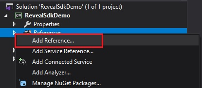
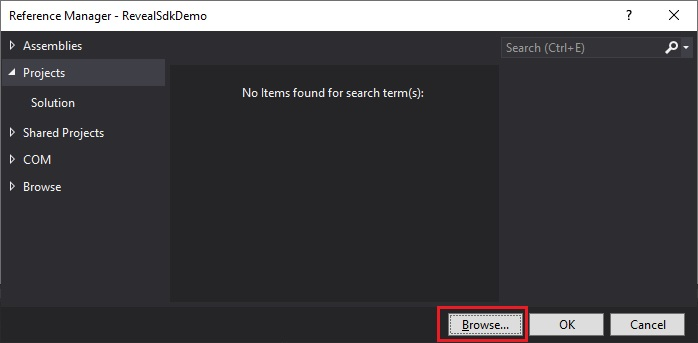
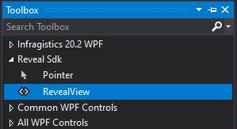
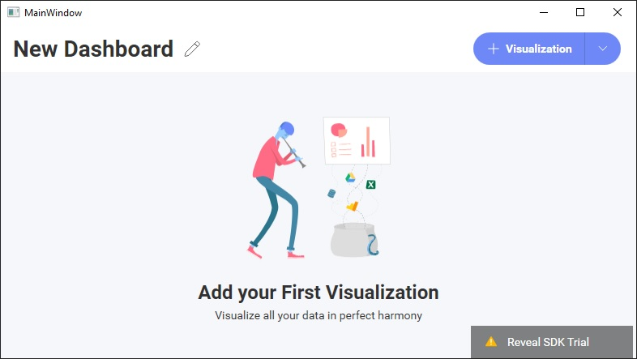

# Getting Started with Reveal SDK

## Step 1 - Create a New WPF Project
The steps below describe how to create a new WPF project. If you want to add the Reveal SDK to an existing application, go to [Step 2](#step-2---add-reveal-sdk).

1 - Start Visual Studio 2019 and click **Create a new project** on the start page, select the **WPF App (.NET Framework)** template, and click **Next**.


2 - Provide a project name, select **.NET Framework 4.6.2** or higher, and click **Create**.


## Step 2 - Add Reveal SDK

### NuGet

1 - Right click the Solution, or Project, and select **Manage NuGet Packages** for Solution.


2 - In the package manager dialog, open the **Browse** tab and install the **Reveal.Sdk.Wpf** NuGet package found at [NuGet.org](https://www.nuget.org/packages/Reveal.Sdk.Wpf/).


### Manually

1 - Right click the References node in the Solution Explorer, and select **Add Reference**.



2 - Click the **Browse** button and select all the assemblies dropped by the installer at **%public%\Documents\Infragistics\Reveal\SDK\WPF\Binaries**.



3 - Install the following NuGet packages, which the Reveal SDK depends on:
   1. CefSharp.Wpf (87.1.132+) 
   2. SkiaSharp (1.68.0+)
   3. System.Data.SQLite.Core (1.0.108+)
   4. Microsoft.Data.SqlClient (1.1.3+)

## Step 3 - Add RevealView Control

### Using XAML

1 - Open the **MainWindow.xaml** file and add the `xmlns:rv="http://revealbi.io/"` namespace

```xml
xmlns:rv="http://revealbi.io/"
```

2 - Add the RevealView to the content of the MainWindow

```xml
<rv:RevealView />
```

### Using the Toolbox

1 - Open the **MainWindow.xaml** file

2 - Open the Visual Studio Toolbox and find the **RevealView** control under the **Reveal SDK** toolbox tab



3 - Click and drag the **RevealView** control onto the design surface of the **MainWindow.xaml** file. The Reveal SDK namespace and the RevealView control will both be added to the MainWindow.xaml file.


## Step 4 - Run Application

Press F5 to run the application.



**Congratulations!** You have written your first Reveal SDK application.

Next Steps:
- [Create New Dashboards](creating-dashboards.md)
- [Load Existing Dashboards](loading-dashboards.md)

> [!NOTE]
> The source code to this sample can be found on [GitHub](https://github.com/RevealBi/sdk-samples-wpf/tree/master/01-GettingStarted).