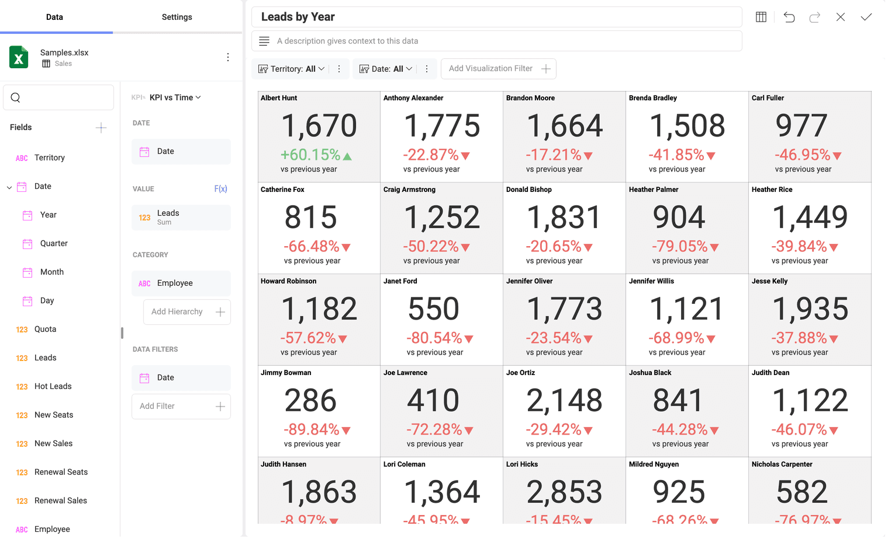

# KPI ゲージ

KPI (Key Performance Indicator: キー パフォーマンス インジケーター) は、企業が主要なビジネス目標をどれだけ効果的に達成しているかを示す測定可能な値です。KPI は個別のニーズによって変化し、目標に対する進捗や時間軸での傾向など、組織の重要なメトリックスに関する情報を提供します。

[テキスト ゲージ](gauge-charts.md#テキスト-ゲージ) と同様に、KPI ゲージは [値] 列を大きなフォントで表示します。ただし、KPI の値は、前の期間の同じ値に対しても評価されます。

カテゴリを追加すると、1 つの表示形式に複数の KPI を含めることもできます。

## インジケーター設定

KPI ゲージには[スパークライン](sparkline-charts.md)表示形式と同様の設定があり、それを使用して構成できます:

  - **[期間]**: 両方の値を比較するために使用する期間。
  - **[差異の表示]**: 差異を [値]、[パーセンテージ]、または [値とパーセンテージ] の両方として表示するかどうか。
  - **[値の増加を表す色]**: 差異インジケータの色。

