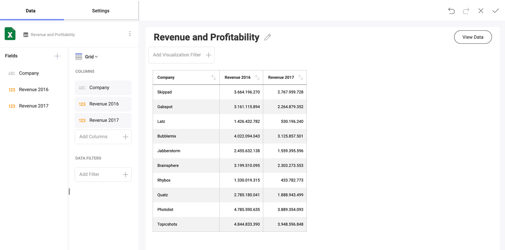

# サンプル、ヒント、および便利なケース
## ベーシックなサンプル式

以下は計算フィールドのサンプル式のセットです。

| 関数名              | 関数をテストするためのサンプル データセット        | 式                                                        | サンプル出力                          |
| -------------------------- |----------------------------------------| ----------------------------------------------------------------- | -------------------------------------- |
| **Opposite Value**         | <a href="/data/HR%20Dataset_2016.xlsx" download>HR Dataset</a> | \-[Wage]                                                          | \-36,542.00 (for Joan Baez)            |
| **Age**                    | <a href="/data/HR%20Dataset_2016.xlsx" download>HR Dataset</a> | (today()-[BirthDate])/365                                         | 50.13 (for Joan Baez)                  |
| **Name & Department**      | <a href="/data/HR%20Dataset_2016.xlsx" download>HR Dataset</a> | [Fullname]& ", " &[Department]                                    | Joan Baez, Development (for Joan Baez) |
|**Sales Percentage** | <a href="/data/Samples.xlsx" download>Samples</a>                                       | [New Sales]*100/sum([New Sales]) | 9,26% (for Japan)                    |
| **Name starts with J**     | <a href="/data/HR%20Dataset_2016.xlsx" download>HR Dataset</a> | if(find("j",lower([Fullname]),1)=1,"Starts with J",0)             | Starts with J, 0                       |
| **Deviation from Avg**     | <a href="/data/HR%20Dataset_2016.xlsx" download>HR Dataset</a> | [Wage]-average([Wage])                                            | \-50476.71 (for Joan Baez)             |

## Unix 更新日時を使用可能な日付へ変換

1970 年 1 月 1 日後の秒によって定義される Unix 時間 (Epoch 時間) はすべてのタイムゾーンを一度に表すために便利です。Unix 更新日時を持つデータ ソースをインポートする場合、[`date`](date.md) 数式を使用して利用可能な日付に変換できます。

`((([Unix Time Stamp]/60)/60)/24)+DATE(1970,1,1)+([Timezone]/24)`

説明:

  - **オリジナルのフィールド**: [Unix Time Stamp]

  - **分に変換**: /60

  - **時に変換**: /60

  - **日に変換**: /24

  - **Epoch 時間の追加**: +DATE(1970,1,1)

  - **タイムゾーンの追加**: +([Timezone]/24)

タイムゾーンを数値として入力するか、数値を持つフィールドを使用できます。GMT 時間が必要です。

## YoY 解析: 売上を 2 年期間の比較

計算フィールドを簡易な YOY 解析を実行するために作成できます。

以下のダッシュボードを参照します。会社の事業部および 2 年間の売上を表示します。

以下の計算フィールドを使用して 2 つの数値を比較できます。「-1」 は年の違いを減算します。

`([Revenue 2017]/[Revenue 2016])-1`

数値を使用するか、[パーセンテージとして書式](../field-settings.md#数値フィールド)設定できます。

