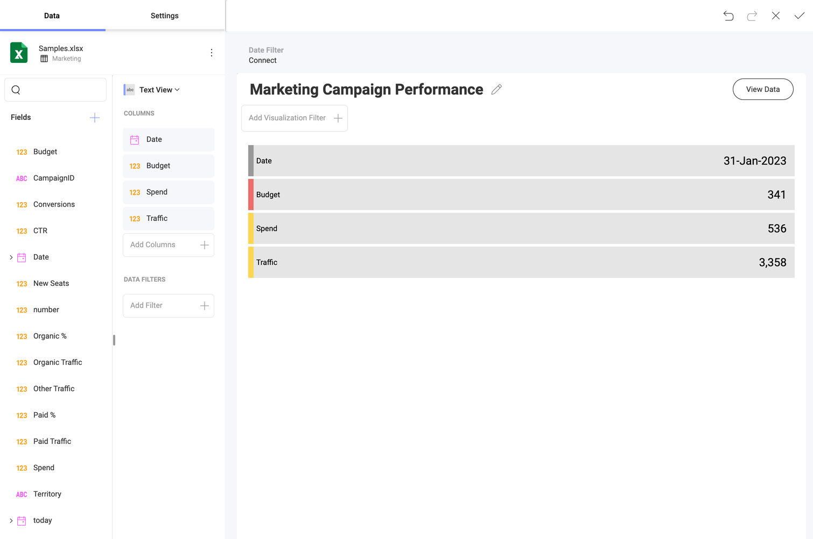
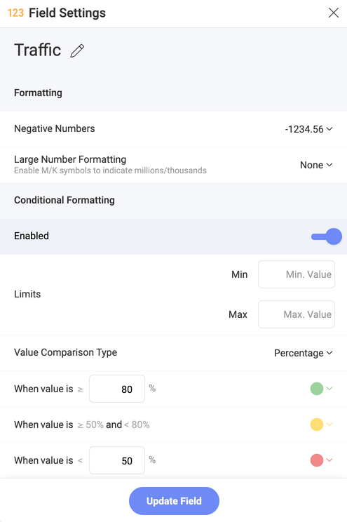

# 条件付き書式

条件付き書式を使用して数値列の値に応じて、セル (または[テキス トビュー](../chart-types/text-view.md)の行) に異なる書式を設定できます。たとえば、グリッドの下位 50% 範囲内の値は、非常に低い値を通知する赤色のアドナーで色を付けることができます。

条件付き書式の設定では、データの範囲ごとに、3 つまでの範囲に (一般的には、中央上部、下部範囲スタイル設定に使用) スタイル規則を設定することができます。低い値が適しているかどうかは情報の性質によります。状況に応じて最も理にかなった方法でスタイルを設定できる柔軟性があります。

## 条件付き書式設定の有効化

数値列で条件付き書式を有効にするには、**[フィールドの設定]** ダイアログボックスを表示するためにデータ エディターのフィールドを選択します。条件付き書式は、設定の最後のオプションであり、デフォルトでは無効になっています。

  - **制限**: これらの値は自動的に指定された値の列のデータセット内の最高値/最低値として設定されますが、一定の値を使用して手動でオーバーライドすることができます。

  - **データ範囲**: データのスタイル設定に使用する 3 つの範囲。すべての範囲にはドロップダウンで定義済みのインジケーターと色のいずれかを選択できます。

      - **値比較タイプ**: 範囲をパーセンテージまたは数値にします。

      - **値は ≥ の場合**: 入力した数値より大きい値の書式。

      - **値は ≥ の場合および \<**: 最初と 3 番目の範囲に入力する値に依存する固定範囲です。

      - **値は \< の場合**: 入力した数値より小さい値の書式設定。

## サポートされている表示形式

条件付き書式は、以下の表示形式に適用できます。

  - [グリッド チャート](../chart-types/grid-chart.md)

  - [ピボット チャート](../chart-types/pivot-table.md)

  - [テキスト ビュー](../chart-types/text-view.md)

:::note
[KPI](../chart-types/kpi-gauge.md)、[リニア](../chart-types/gauge-charts.md#リニア-ゲージ)、[円形](../chart-types/gauge-charts.md#円形ゲージ)、[テキスト](../chart-types/gauge-charts.md#テキスト-ゲージ)、および[ブレット グラフ](../chart-types/gauge-charts.md#ブレット-グラフ) ゲージは、[**表示形式バンドの範囲の構成**](../chart-types/gauge-charts.md#バンドの構成)で条件付き書式をサポートします。
:::