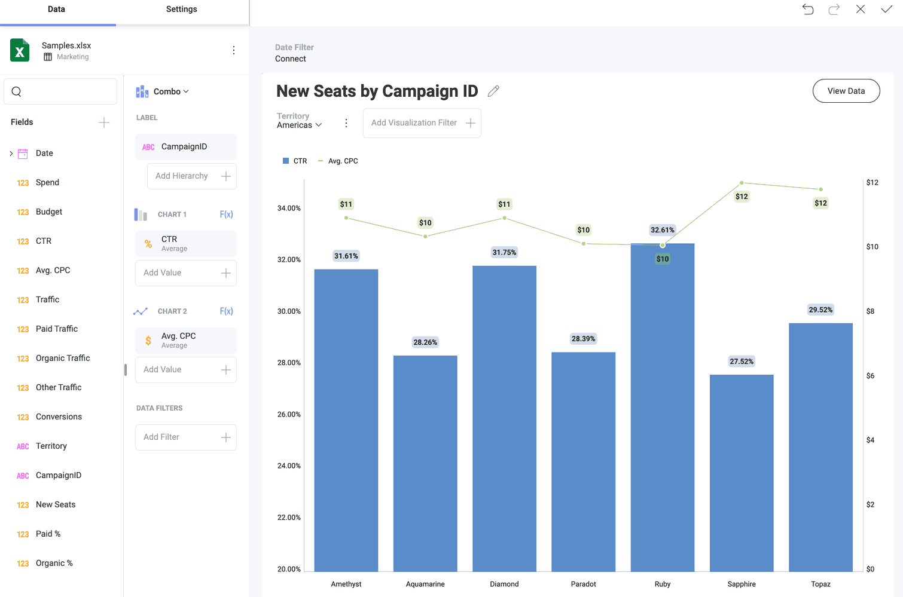

# フィールド

このセクションでは、データセットのフィールドに変換を適用するためのさまざまなオプションについて説明します。フィルターを適用することにより、フィールドの情報をビジネス分析用に最適化できます。必要のないノイズを削除し、最も重要なアスペクトを強調表示して、さまざまな方法で情報を要約します。

## トピックの概要

いくつかのフィールド設定とフィルタリング オプションがあります。

  - ラベルの名前変更、集計、並べ替え、書式、[条件付き書式](conditional-formatting.md)を含む[日付](field-settings.md#日付フィールド)、[数値](field-settings.md#数値フィールド)および[文字列](field-settings.md#文字列フィールド)フィールドの設定。

  - [空値](field-filters-rules.md#空値をフィルター)のフィルター。

  - [特定の値を選択する](field-filters-rules.md#値の選択)ためのフィルター。

  - [ルール](field-filters-rules.md#ルールでフィルタリング)でフィルター。

データセットがダッシュボード キャンバスに追加されると自動的に表示される[表示形式エディター](../visualization-editor.md)を介して、フィールド設定とルールにアクセスできます。
