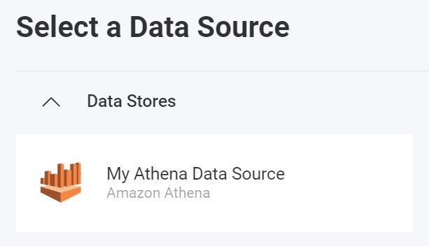

import Tabs from '@theme/Tabs';
import TabItem from '@theme/TabItem';

# Adding an Amazon Athena Data Source

**Step 1** - Add an event handler for the `RevealView.onDataSourcesRequested` event.

```js
var revealView = new $.ig.RevealView("#revealView");
revealView.onDataSourcesRequested = (callback) => {
    //add code here
    callback(new $.ig.RevealDataSources([], [], false));
};
```

**Step 2** - In the `RevealView.onDataSourcesRequested` event handler, create a new instance of the [RVAthenaDataSource](https://help.revealbi.io/api/javascript/latest/classes/rvathenadatasource.html) object. Set the `Title`, `Subtitle`, `Region`, and `Database` properties. After you have created the `RVAthenaDataSource` object, add it to the data sources collection.

```js
revealView.onDataSourcesRequested = (callback) => {
    var athenaDS = new $.ig.RVAthenaDataSource();
    athenaDS.title = "My Athena Data Source";
    athenaDS.subtitle = "Amazon Athena";
    athenaDS.region = "region";
    athenaDS.database = "database";

    callback(new $.ig.RevealDataSources([athenaDS], [], false));
};
```

When the application runs, create a new Visualization and you will see the newly created Amazon Athena data source listed in the "Select a Data Source" dialog.



**Step 3** - Create a new Amazon Athena Data Source Item by creating a new instance of the [RVAthenaDataSourceItem](https://help.revealbi.io/api/javascript/latest/classes/rvathenadatasourceitem.html) object. Specify the values for the `Title`, `Subtitle`, and `Table` properties. After you have created the `RVAthenaDataSourceItem` object, add it to the data source items collection.

```js
revealView.onDataSourcesRequested = (callback) => {
    var athenaDS = new $.ig.RVAthenaDataSource();
    athenaDS.title = "My Athena Data Source";
    athenaDS.subtitle = "Amazon Athena";
    athenaDS.region = "region";
    athenaDS.database = "database";

    var athenaDSI = new $.ig.RVAthenaDataSourceItem(athenaDS);
    athenaDSI.title = "My Athena Data Source Item";
    athenaDS.subtitle = "Amazon Athena";
    athenaDSI.table = "table";

    callback(new $.ig.RevealDataSources([athenaDS], [athenaDSI], false));
};
```

When the application runs, create a new Visualization and you will see the newly created Amazon Athena data source item listed in the "Select a Data Source" dialog.


:::note

Amazon Athena authenticates using a `RVAmazonWebServicesCredentials`. See the [Authentication](../authentication#amazon-web-services) topic for more information.

:::

:::info Get the Code

The source code to this sample can be found on [GitHub](https://github.com/RevealBi/sdk-samples-javascript/tree/main/DataSources/Amazon-Athena)

:::