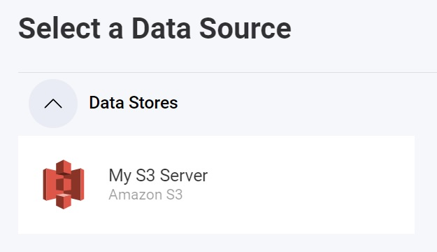

import Tabs from '@theme/Tabs';
import TabItem from '@theme/TabItem';

# Amazon S3 データ ソースの追加

:::danger 重大な変更

現在、Reveal SDK は、Reveal SDK core パッケージからデータ ソースを分離する過程にあります。プロジェクトの継続的な機能を確保するために、プロジェクトに追加のパッケージをインストールすることが必要になる場合があります。詳細については、[サポートされるデータ ソース](web/datasources.md#サポートされるデータ-ソース) トピックを参照してください。

:::

**手順 1** - `RevealView.onDataSourcesRequested` イベントのイベント ハンドラーを追加します。

```js
var revealView = new $.ig.RevealView("#revealView");
revealView.onDataSourcesRequested = (callback) => {
    //add code here
    callback(new $.ig.RevealDataSources([], [], false));
};
```

**手順 2** - `RevealView.onDataSourcesRequested` イベント ハンドラーで、[RVS3DataSource](https://help.revealbi.io/api/javascript/latest/classes/rvgoogledrivedatasource.html) オブジェクトの新しいインスタンスを作成します。`Title`、`Subtitle`、および `Region` プロパティを設定します。`RVS3DataSource` オブジェクトを作成したら、それをデータ ソース コレクションに追加します。

```js
revealView.onDataSourcesRequested = (callback) => {
    var s3 = new $.ig.RVS3DataSource();
    s3.title = "My S3 Server";
    s3.subtitle = "Amazon S3";
    s3.region = "region";

    callback(new $.ig.RevealDataSources([s3], [], false));
};
```

アプリケーションを実行し、新しい可視化を作成すると、新しく作成された Amazon S3 データ ソースが [データ ソースの選択] ダイアログに表示されます。



:::note

`RVS3DataSource` は、Reveal SDK に登録された認証プロバイダーに基づいてフォルダーとファイルを読み込みます。Amazon S3 は `RVAmazonWebServicesCredentials` を使用して認証します。詳細については、[認証](../authentication.md#amazon-web-services)トピックを参照してください。

:::

:::info コードの取得

このサンプルのソース コードは、[GitHub](https://github.com/RevealBi/sdk-samples-javascript/tree/main/DataSources/Amazon-S3) にあります。

:::