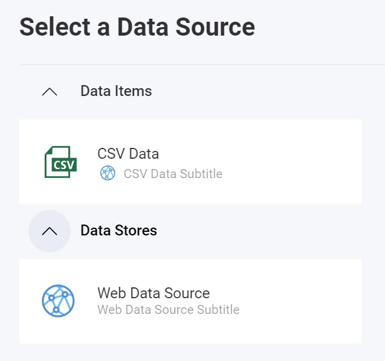

import Tabs from '@theme/Tabs';
import TabItem from '@theme/TabItem';

# CSV データ ソースの追加

:::danger breaking changes

現在、Reveal SDK は、Reveal SDK core パッケージからデータ ソースを分離する過程にあります。 プロジェクトの継続的な機能を確保するために、プロジェクトに追加のパッケージをインストールすることが必要になる場合があります。 詳細については、[サポートされるデータ ソース](web/datasources.md#サポートされるデータ-ソース) トピックを参照してください。

:::

**手順 1** - `RevealView.onDataSourcesRequested` イベントのイベント ハンドラーを追加します。

```js
var revealView = new $.ig.RevealView("#revealView");
revealView.onDataSourcesRequested = (callback) => {
    //add code here
    callback(new $.ig.RevealDataSources([], [], false));
};
```

**手順 2** - `RevealView.onDataSourcesRequested` イベント ハンドラーで、[RVWebResourceDataSource](https://help.revealbi.io/api/javascript/latest/classes/rvwebresourcedatasource.html) オブジェクトの新しいインスタンスを作成します。CSV リソースへのアクセスに認証が必要ない場合は、`URL` プロパティを CSV リソースの URL に設定し、`useAnonymousAuthentication` プロパティを `false` に設定します。オプションで、`RVWebResourceDataSource` オブジェクトをコールバックのデータ ソース コレクションに追加して、RevealView の [データ ソース] ダイアログに表示できます。

```js
revealView.onDataSourcesRequested = (callback) => {
    const webDS = new $.ig.RVWebResourceDataSource();
    webDS.title = "Web Data Source";
    webDS.subtitle = "Web Data Source Subtitle";
    webDS.url = "https://raw.githubusercontent.com/fivethirtyeight/data/master/airline-safety/airline-safety.csv";
    webDS.useAnonymousAuthentication = true;

    callback(new $.ig.RevealDataSources([webDS], [], false));
};
```

アプリケーションを実行し、新しい可視化を作成すると、新しく作成された Web リソース データ ソースが [データ ソースの選択] ダイアログに表示されます。


**手順 3** - [データ ソース] ダイアログの **[CSV の設定]** 画面をスキップして CSV データを直接使用するには、[RVWebResourceDataSourceItem](https://help.revealbi.io/api/javascript/latest/classes/rvwebresourcedatasourceitem.html) の新しいインスタンスを作成し、前の手順で作成した `RVWebResourceDataSource` オブジェクトをコンストラクター引数として渡します。次に、[RVCsvDataSourceItem](https://help.revealbi.io/api/javascript/latest/classes/rvcsvdatasourceitem.html) の新しいインスタンスを作成し、`RVWebResourceDataSourceItem` をコンストラクター引数として渡します。`Title`、`Subtitle`、およびその他の必要なプロパティを設定します。`RVCsvDataSourceItem` オブジェクトを作成したら、それをデータ ソース項目コレクションに追加します。

```js
revealView.onDataSourcesRequested = (callback) => {
    const webDS = new $.ig.RVWebResourceDataSource();
    webDS.title = "Web Data Source";
    webDS.subtitle = "Web Data Source Subtitle";
    webDS.url = "https://raw.githubusercontent.com/fivethirtyeight/data/master/airline-safety/airline-safety.csv";
    webDS.useAnonymousAuthentication = true;

    //to skip the "Set up your CSV" dialog and directly use the CSV data
    const webDSI = new $.ig.RVWebResourceDataSourceItem(webDS);            
    const csvDSI = new $.ig.RVCsvDataSourceItem(webDSI);
    csvDSI.title = "CSV Data";
    csvDSI.subtitle = "CSV Data Subtitle";

    callback(new $.ig.RevealDataSources([webDS], [csvDSI], false));
};
```

アプリケーションを実行し、新しい可視化を作成すると、新しく作成された CSV データ ソース項目が [データ ソースの選択] ダイアログに表示されます。




:::info コードの取得

このサンプルのソース コードは、[GitHub](https://github.com/RevealBi/sdk-samples-javascript/tree/main/DataSources/Csv) にあります。

:::