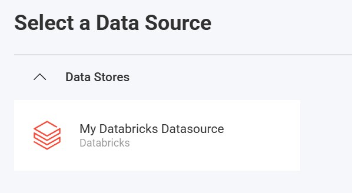
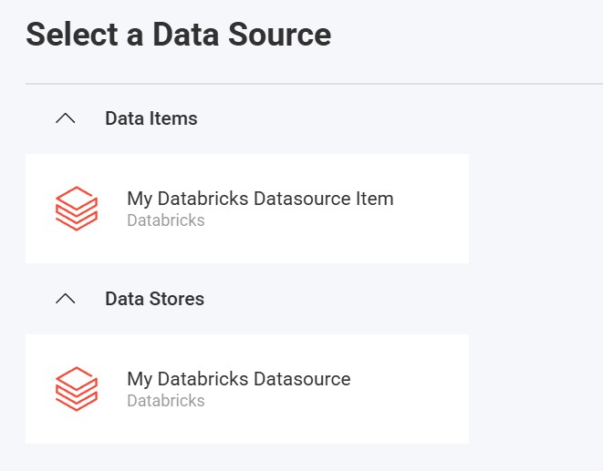

import Tabs from '@theme/Tabs';
import TabItem from '@theme/TabItem';

# Databricks Data Source

## Introduction

Databricks is a unified analytics platform that helps data engineering and data science teams collaborate on data processing, machine learning, and analytics at massive scale. This topic explains how to connect to Databricks data sources in your Reveal application to visualize and analyze your data.

:::important Prerequisites
Before configuring the Databricks data source in Reveal, you must install the appropriate database driver:
- For Windows/.NET: [Databricks ODBC Driver](https://www.databricks.com/spark/odbc-drivers-download)
- For Node.js: [Databricks ODBC Driver](https://www.databricks.com/spark/odbc-drivers-download)
- For Java: The JDBC driver is installed automatically via Maven.

These drivers are essential for establishing connections to your Databricks data source. After installation, ensure the drivers are properly configured according to Databricks documentation.
:::

## Server Configuration

### Installation

<Tabs groupId="code" queryString>
  <TabItem value="aspnet" label="ASP.NET" default>

**Step 1** - Install the Reveal Databricks connector package

For ASP.NET applications, you need to install a separate NuGet package to enable Databricks support:

```bash
dotnet add package Reveal.Sdk.Data.Databricks
```

**Step 2** - Register the Databricks data source in your application:

```csharp
builder.Services.AddControllers().AddReveal( builder =>
{
    builder.RegisterDatabricks();
});
```

  </TabItem>
  <TabItem value="node" label="Node.js">

For Node.js applications, the Databricks data source is already included in the main Reveal SDK package. No additional installation is required beyond the standard Reveal SDK setup.

  </TabItem>
  <TabItem value="java" label="Java">

For Java applications, the Databricks data source is already included in the main Reveal SDK package. No additional installation is required beyond the standard Reveal SDK setup.

  </TabItem>
</Tabs>

### Connection Configuration

<Tabs groupId="code" queryString>
  <TabItem value="aspnet" label="ASP.NET" default>

```csharp
// Create a data source provider
public class DataSourceProvider : IRVDataSourceProvider
{
    public async Task<RVDataSourceItem> ChangeDataSourceItemAsync(IRVUserContext userContext, string dashboardId, RVDataSourceItem dataSourceItem)
    {
        // Required: Update the underlying data source
        await ChangeDataSourceAsync(userContext, dataSourceItem.DataSource);

        if (dataSourceItem is RVDatabricksDataSourceItem databricksItem)
        {            
            // Configure specific item properties as needed
            if (databricksItem.Id == "databricks_sales_data")
            {
                databricksItem.Table = "sales_data";
            }
        }
        
        return dataSourceItem;
    }

    public Task<RVDashboardDataSource> ChangeDataSourceAsync(IRVUserContext userContext, RVDashboardDataSource dataSource)
    {
        if (dataSource is RVDatabricksDataSource databricksDS)
        {
            // Configure connection properties
            databricksDS.Host = "your-databricks-instance.cloud.databricks.com";
            databricksDS.HttpPath = "/sql/1.0/warehouses/abc123";
            databricksDS.Port = 443;
            databricksDS.Database = "default";
            databricksDS.Schema = "public";
        }
        
        return dataSource;
    }
}
```

  </TabItem>
  <TabItem value="node" label="Node.js">

```javascript
// Create data source providers
const dataSourceItemProvider = async (userContext, dataSourceItem) => {
    // Required: Update the underlying data source
    await dataSourceProvider(userContext, dataSourceItem.dataSource);

    if (dataSourceItem instanceof reveal.RVDatabricksDataSourceItem) {        
        // Configure specific item properties if needed
        if (dataSourceItem.id === "databricks_sales_data") {
            dataSourceItem.table = "sales_data";
        }
    }
    
    return dataSourceItem;
}

const dataSourceProvider = async (userContext, dataSource) => {
    if (dataSource instanceof reveal.RVDatabricksDataSource) {
        // Configure connection properties
        dataSource.host = "your-databricks-instance.cloud.databricks.com";
        dataSource.httpPath = "/sql/1.0/warehouses/abc123";
        dataSource.port = 443;
        dataSource.database = "default";
        dataSource.schema = "public";
    }
    
    return dataSource;
}
```

  </TabItem>
    <TabItem value="node-ts" label="Node.js - TS">

```typescript
// Create data source providers
const dataSourceItemProvider = async (userContext: IRVUserContext | null, dataSourceItem: RVDataSourceItem) => {
    // Required: Update the underlying data source
    await dataSourceProvider(userContext, dataSourceItem.dataSource);

    if (dataSourceItem instanceof RVDatabricksDataSourceItem) {        
        // Configure specific item properties if needed
        if (dataSourceItem.id === "databricks_sales_data") {
            dataSourceItem.table = "sales_data";
        }
    }
    
    return dataSourceItem;
}

const dataSourceProvider = async (userContext: IRVUserContext | null, dataSource: RVDashboardDataSource) => {
    if (dataSource instanceof RVDatabricksDataSource) {
        // Configure connection properties
        dataSource.host = "your-databricks-instance.cloud.databricks.com";
        dataSource.httpPath = "/sql/1.0/warehouses/abc123";
        dataSource.port = 443;
        dataSource.database = "default";
        dataSource.schema = "public";
    }
    
    return dataSource;
}
```

  </TabItem>
  <TabItem value="java" label="Java">

```java
// Create a data source provider
public class DataSourceProvider implements IRVDataSourceProvider {

    public RVDataSourceItem changeDataSourceItem(IRVUserContext userContext, String dashboardId, RVDataSourceItem dataSourceItem) {
        // Required: Update the underlying data source
        changeDataSource(userContext, databricksItem.getDataSource());

        if (dataSourceItem instanceof RVDatabricksDataSourceItem databricksItem) {            
            // Configure specific item properties if needed
            if ("databricks_sales_data".equals(databricksItem.getId())) {
                databricksItem.setTable("sales_data");
            }
        }
        
        return dataSourceItem;
    }

    public RVDashboardDataSource changeDataSource(IRVUserContext userContext, RVDashboardDataSource dataSource) {
        if (dataSource instanceof RVDatabricksDataSource databricksDS) {
            // Configure connection properties
            databricksDS.setHost("your-databricks-instance.cloud.databricks.com");
            databricksDS.setHttpPath("/sql/1.0/warehouses/abc123");
            databricksDS.setPort(443);
            databricksDS.setDatabase("default");
            databricksDS.setSchema("public");
        }
        
        return dataSource;
    }
}
```

  </TabItem>
</Tabs>

:::danger Important
Any changes made to the data source in the `ChangeDataSourceAsync` method are not carried over into the `ChangeDataSourceItemAsync` method. You **must** update the data source properties in both methods. We recommend calling the `ChangeDataSourceAsync` method within the `ChangeDataSourceItemAsync` method passing the data source item's underlying data source as the parameter as shown in the examples above.
:::

### Authentication

Authentication for Databricks is handled on the server side using a personal access tokens. For detailed information on authentication options, see the [Authentication](../authentication.md) topic.

<Tabs groupId="code" queryString>
  <TabItem value="aspnet" label="ASP.NET" default>

```csharp
public class AuthenticationProvider: IRVAuthenticationProvider
{
    public Task<IRVDataSourceCredential> ResolveCredentialsAsync(IRVUserContext userContext, RVDashboardDataSource dataSource)
    {
        IRVDataSourceCredential userCredential = null;
        if (dataSource is RVDatabricksDataSource)
        {
            // Use Personal Access Token
            userCredential = new RVBearerTokenDataSourceCredential("your_personal_access_token", "your_userid");
        }
        return Task.FromResult<IRVDataSourceCredential>(userCredential);
    }
}
```

  </TabItem>
  <TabItem value="node" label="Node.js">

```javascript
const authenticationProvider = async (userContext, dataSource) => {
    if (dataSource instanceof reveal.RVDatabricksDataSource) {
        // Use Personal Access Token
        return new reveal.RVBearerTokenDataSourceCredential("your_personal_access_token", "your_userid");
    }
    return null;
}
```

  </TabItem>
    <TabItem value="node-ts" label="Node.js - TS">

```ts
const authenticationProvider = async (userContext: IRVUserContext | null, dataSource: RVDashboardDataSource) => {
    if (dataSource instanceof RVDatabricksDataSource) {
        // Use Personal Access Token
        return new RVBearerTokenDataSourceCredential("your_personal_access_token", "your_userid");
    }
    return null;
}
```

  </TabItem>
  <TabItem value="java" label="Java">

```java
public class AuthenticationProvider implements IRVAuthenticationProvider {
    @Override
    public IRVDataSourceCredential resolveCredentials(IRVUserContext userContext, RVDashboardDataSource dataSource) {
        if (dataSource instanceof RVDatabricksDataSource) {
            // Use Personal Access Token
            return new RVBearerTokenDataSourceCredential("your_personal_access_token", "your_userid");
        }
        return null;
    }
}
```

  </TabItem>
</Tabs>

## Client-Side Implementation

On the client side, you only need to specify basic properties like ID, title, and subtitle for the data source. The actual connection configuration happens on the server.

### Creating Data Sources

**Step 1** - Add an event handler for the `RevealView.onDataSourcesRequested` event.

```js
const revealView = new $.ig.RevealView("#revealView");
revealView.onDataSourcesRequested = (callback) => {
    // Add data source here
    callback(new $.ig.RevealDataSources([], [], false));
};
```

**Step 2** - In the `RevealView.onDataSourcesRequested` event handler, create a new instance of the `RVDatabricksDataSource` object. Set the `title` and `subtitle` properties. After you have created the `RVDatabricksDataSource` object, add it to the data sources collection.

```js
revealView.onDataSourcesRequested = (callback) => {
    const databricksDS = new $.ig.RVDatabricksDataSource();
    databricksDS.title = "Databricks";
    databricksDS.subtitle = "Data Source";
    
    callback(new $.ig.RevealDataSources([databricksDS], [], false));
};
```

When the application runs, create a new Visualization and you will see the newly created Databricks data source listed in the "Select a Data Source" dialog.



### Creating Data Source Items

Data source items represent specific datasets within your Databricks data source that users can select for visualization. On the client side, you only need to specify ID, title, and subtitle.

```js
revealView.onDataSourcesRequested = (callback) => {
    // Create the data source
    const databricksDS = new $.ig.RVDatabricksDataSource();
    databricksDS.title = "My Databricks Datasource";
    databricksDS.subtitle = "Databricks";
    
    // Create a data source item
    const databricksDSI = new $.ig.RVDatabricksDataSourceItem(databricksDS);
    databricksDSI.id = "databricks_sales_data";
    databricksDSI.title = "My Databricks Datasource Item";
    databricksDSI.subtitle = "Databricks";

    callback(new $.ig.RevealDataSources([databricksDS], [databricksDSI], false));
};
```

When the application runs, create a new Visualization and you will see the newly created Databricks data source item listed in the "Select a Data Source" dialog.



## Additional Resources

- [Databricks SQL Documentation](https://docs.databricks.com/sql/index.html)
- [Databricks ODBC Drivers](https://www.databricks.com/spark/odbc-drivers-download)
- [Databricks JDBC Drivers](https://www.databricks.com/spark/jdbc-drivers-download)
- [Sample Source Code on GitHub](https://github.com/RevealBi/sdk-samples-javascript/tree/main/DataSources/Databricks)

## API Reference

<Tabs groupId="code" queryString>
<TabItem value="aspnet" label="ASP.NET" default>

* [RVDatabricksDataSource](https://help.revealbi.io/api/aspnet/latest/Reveal.Sdk.Data.Databricks.RVDatabricksDataSource.html) - Represents a Databricks data source
* [RVDatabricksDataSourceItem](https://help.revealbi.io/api/aspnet/latest/Reveal.Sdk.Data.Databricks.RVDatabricksDataSourceItem.html) - Represents a Databricks data source item

</TabItem>
<TabItem value="node" label="Node.js">

* [RVDatabricksDataSource](https://help.revealbi.io/api/javascript/latest/classes/rvdatabricksdatasource.html) - Represents a Databricks data source
* [RVDatabricksDataSourceItem](https://help.revealbi.io/api/javascript/latest/classes/rvdatabricksdatasourceitem.html) - Represents a Databricks data source item

</TabItem>
</Tabs>