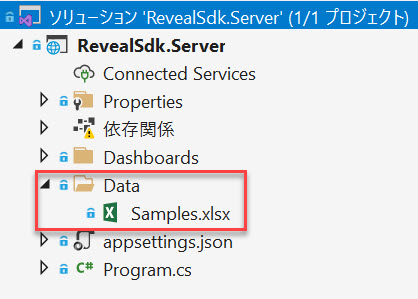

import Tabs from '@theme/Tabs';
import TabItem from '@theme/TabItem';

# Excel ファイル データ ソースの追加

:::danger breaking changes

現在、Reveal SDK は、Reveal SDK core パッケージからデータ ソースを分離する過程にあります。 プロジェクトの継続的な機能を確保するために、プロジェクトに追加のパッケージをインストールすることが必要になる場合があります。 詳細については、[サポートされるデータ ソース](web/datasources.md#サポートされるデータ-ソース) トピックを参照してください。

:::

**手順 1** - サーバー アプリケーションで、Excel ファイルを格納するフォルダーを作成します。

<Tabs groupId="code" queryString>
  <TabItem value="aspnet" label="ASP.NET" default>



  </TabItem>

  <TabItem value="java" label="Java">


  </TabItem>

  <TabItem value="node" label="Node.js">    


  </TabItem>
</Tabs>

**手順 2** - `RevealEmbedSettings.LocalFileStoragePath` プロパティを**手順 1** で作成したフォルダーの場所に設定します。

<Tabs groupId="code" queryString>
  <TabItem value="aspnet" label="ASP.NET" default>

```cs
builder.Services.AddControllers().AddReveal( builder =>
{
    builder.AddSettings(settings =>
   {
       settings.LocalFileStoragePath = "Data";
   });
});
```

  </TabItem>

  <TabItem value="java" label="Java">

```java
RevealEngineInitializer.initialize(new InitializeParameterBuilder()
.setLocalFilesStoragePath("data")
.build());
```

  </TabItem>

  <TabItem value="node" label="Node.js">    

```ts
const revealOptions: RevealOptions = {
    localFileStoragePath: "data"
}
app.use('/', reveal(revealOptions));
```

  </TabItem>
</Tabs>

**手順 3** - `RevealView.onDataSourcesRequested` イベントのイベント ハンドラーを追加します。

まず、`id` を `revealView` に設定した `<div>` タグを定義します。

```html
<div id="revealView" style="height: 920px; width: 100%;"></div>
```

`revealView` を初期化し、イベント ハンドラーを追加します。

```js
var revealView = new $.ig.RevealView("#revealView");
revealView.onDataSourcesRequested = (callback) => {
    //add code here
    callback(new $.ig.RevealDataSources([], [], true));
};
```

**手順 4** - `RevealView.onDataSourcesRequested` イベント ハンドラーで、`RVLocalFileDataSourceItem` オブジェクトの新しいインスタンスを作成します。`Uri` プロパティを、データ ソースとして使用する Excel ファイルのパス (ファイル名を含む) に設定します。

```js
revealView.onDataSourcesRequested = (callback) => {
    var localFileItem = new $.ig.RVLocalFileDataSourceItem();
    localFileItem.uri = "local:/Samples.xlsx";

    callback(new $.ig.RevealDataSources([], [], true));
};
```

:::caution

Excel ファイルパスの前に `local:/` を付ける必要があります。これは、`RevealEmbedSettings.LocalFileStoragePath` をファイル パスのルートとして使用してファイルを読み込むように Reveal SDK に指示するためです。ルート パス内にサブフォルダーがある場合は、これらのサブフォルダーを `Uri` プロパティに含めるようにしてください。

例:
* サブフォルダーなし - `RVLocalFileDataSourceItem.Uri = "local:/FileName.xlsx"`
* サブフォルダーあり - `RVLocalFileDataSourceItem.Uri = "local:/SubFolder/FileName.xlsx"`

:::

**手順 5** - 前の手順で作成した `RVLocalFileDataSourceItem` インスタンスをコンストラクター引数に指定して、`RVExcelDataSourceItem` オブジェクトの新しいインスタンスを作成し、`Title` プロパティを Excel ファイル内のデータを説明する文字列に設定します。

最後に、`RVExcelDataSourceItem` オブジェクトを `callback` のデータ ソース項目配列に追加します。

```js
revealView.onDataSourcesRequested = (callback) => {
    var localFileItem = new $.ig.RVLocalFileDataSourceItem();
    localFileItem.uri = "local:/Samples.xlsx";

    var excelDataSourceItem  = new $.ig.RVExcelDataSourceItem(localFileItem);
    excelDataSourceItem .title = "Local Excel File";

    callback(new $.ig.RevealDataSources([], [excelDataSourceItem], true));
};
```

アプリケーションを開始し、新しい表示形式を作成すると、[データ ソースの選択] ダイアログに新しく作成された Excel ファイル データ ソースが表示されます。


:::info コードの取得

このサンプルのソース コードは [GitHub](https://github.com/RevealBi/sdk-samples-javascript/tree/main/DataSources/ExcelFile) にあります。

:::

:::caution

サーバーがクライアント アプリケーションとは異なる URL で実行されている場合は、`$.ig.RevealSdkSettings.setBaseUrl` を呼び出す必要があります。サーバー アプリケーションとクライアント アプリケーションの両方が同じ URL で実行されている場合、このメソッドは必要ありません。このメソッドを呼び出す必要があるのは 1 回だけです。

:::
