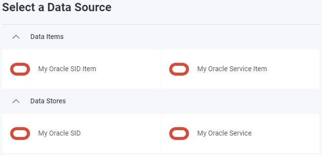

import Tabs from '@theme/Tabs';
import TabItem from '@theme/TabItem';

# Oracle データ ソースの追加

:::danger 重大な変更

現在、Reveal SDK は、Reveal SDK core パッケージからデータ ソースを分離する過程にあります。プロジェクトの継続的な機能を確保するために、プロジェクトに追加のパッケージをインストールすることが必要になる場合があります。詳細については、[サポートされるデータ ソース](web/datasources.md#サポートされるデータ-ソース) トピックを参照してください。

:::

## クライアント側

**手順 1** - `RevealView.onDataSourcesRequested` イベントのイベント ハンドラーを追加します。

```js
var revealView = new $.ig.RevealView("#revealView");
revealView.onDataSourcesRequested = (callback) => {
    //add code here
    callback(new $.ig.RevealDataSources([], [], false));
};
```

**手順 2** - `RevealView.onDataSourcesRequested` イベント ハンドラーで、`RVOracleSIDDataSource` または `RVOracleServiceDataSource` オブジェクト (セットアップに応じて) の新しいインスタンスを作成します。`Host`、`Database`、`Port`、`Title`、および `SID` / `Service` (SID またはサービス名を使用しているかどうかに応じて) プロパティを Oracle サーバーに対応する値に設定します。`RVOracleXXXXDataSource` オブジェクトを作成したら、それをデータ ソース コレクションに追加します。

```js
revealView.onDataSourcesRequested = (callback) => {
    //if you are using SID
    const oracleSIDDataSource = new $.ig.RVOracleSIDDataSource();
    oracleSIDDataSource.id = "MyOracleSIDDataSource";
    oracleSIDDataSource.title = "My Oracle SID";
    oracleSIDDataSource.host = "your-host";
    oracleSIDDataSource.port = "your-port";
    oracleSIDDataSource.database = "your-database";

    //if you are using Service Name
    const oracleServiceDataSource = new $.ig.RVOracleServiceDataSource();
    oracleServiceDataSource.id = "MyOracleServiceDataSource";
    oracleServiceDataSource.title = "My Oracle Service";
    oracleServiceDataSource.host = "your-host";
    oracleServiceDataSource.port = "your-port";
    oracleServiceDataSource.database = "your-database";

    callback(new $.ig.RevealDataSources([oracleSIDDataSource, oracleServiceDataSource], [], true));
};
```

アプリケーションが実行されたら、新しい可視化を作成すると、新しく作成された Oracle データ ソースが [データ ソースの選択] ダイアログに表示されます。


**手順 3** - `RVOracleDataSourceItem` オブジェクトの新しいインスタンスを作成して、新しいデータ ソース項目を追加します。データベース テーブルに対応する `Id`、`Title`、および `Table` プロパティを設定します。`RVOracleDataSourceItem` オブジェクトを作成したら、それをデータ ソース項目コレクションに追加します。

```js
revealView.onDataSourcesRequested = (callback) => {
    //if you are using SID
    const oracleSIDDataSource = new $.ig.RVOracleSIDDataSource();
    oracleSIDDataSource.id = "MyOracleSIDDataSource";
    oracleSIDDataSource.title = "My Oracle SID";
    oracleSIDDataSource.host = "your-host";
    oracleSIDDataSource.port = "your-port";
    oracleSIDDataSource.database = "your-database";

    //if you are using Service Name
    const oracleServiceDataSource = new $.ig.RVOracleServiceDataSource();
    oracleServiceDataSource.id = "MyOracleServiceDataSource";
    oracleServiceDataSource.title = "My Oracle Service";
    oracleServiceDataSource.host = "your-host";
    oracleServiceDataSource.port = "your-port";
    oracleServiceDataSource.database = "your-database";

    const oracleSIDDataSourceItem = new $.ig.RVOracleDataSourceItem(oracleSIDDataSource);
    oracleSIDDataSourceItem.id = "MyOracleSIDDataSourceItem";
    oracleSIDDataSourceItem.title = "My Oracle SID Item";

    const oracleServiceDataSourceItem = new $.ig.RVOracleDataSourceItem(oracleServiceDataSource);
    oracleServiceDataSourceItem.id = "MyOracleServiceDataSourceItem";
    oracleServiceDataSourceItem.title = "My Oracle Service Item";

    callback(new $.ig.RevealDataSources([oracleSIDDataSource, oracleServiceDataSource], [oracleSIDDataSourceItem, oracleServiceDataSourceItem], true));
};
```
 
アプリケーションが実行されたら、新しい可視化を作成すると、新しく作成された Oracle データ ソース項目が [データ ソースの選択] ダイアログに表示されます。



## サーバー側

**手順 1** - クライアントでデータ ソースとデータ ソース項目を作成しますが、接続情報は指定しません。`id`、`title`、および/または `subtitle` のみを入力してください。

```js
revealView.onDataSourcesRequested = (callback) => {
    //if you are using SID
    const oracleSIDDataSource = new $.ig.RVOracleSIDDataSource();
    oracleSIDDataSource.id = "MyOracleSIDDataSource";
    oracleSIDDataSource.title = "My Oracle SID";

    //if you are using Service Name
    const oracleServiceDataSource = new $.ig.RVOracleServiceDataSource();
    oracleServiceDataSource.id = "MyOracleServiceDataSource";
    oracleServiceDataSource.title = "My Oracle Service";

    const oracleSIDDataSourceItem = new $.ig.RVOracleDataSourceItem(oracleSIDDataSource);
    oracleSIDDataSourceItem.id = "MyOracleSIDDataSourceItem";
    oracleSIDDataSourceItem.title = "My Oracle SID Item";

    const oracleServiceDataSourceItem = new $.ig.RVOracleDataSourceItem(oracleServiceDataSource);
    oracleServiceDataSourceItem.id = "MyOracleServiceDataSourceItem";
    oracleServiceDataSourceItem.title = "My Oracle Service Item";

    callback(new $.ig.RevealDataSources([oracleSIDDataSource, oracleServiceDataSource], [oracleSIDDataSourceItem, oracleServiceDataSourceItem], true));
};
``` 

**手順 2** - データ ソース プロバイダーを作成します。この例では、クライアントで定義された **Oracle** データベースに接続するための接続情報を提供しています。これを実現するために、使用しているデータ ソース/項目のタイプを決定し、オブジェクトで使用可能なプロパティを設定します。

<Tabs groupId="code" queryString>
  <TabItem value="aspnet" label="ASP.NET" default>

```cs
public class DataSourceProvider : IRVDataSourceProvider
{
    public Task<RVDataSourceItem> ChangeDataSourceItemAsync(IRVUserContext userContext, string dashboardId,
        RVDataSourceItem dataSourceItem)
    {
        if (dataSourceItem is RVOracleDataSourceItem oracleDataSourceItem)
        {
            //update underlying data source
            ChangeDataSourceAsync(userContext, oracleDataSourceItem.DataSource);

            //only change the table if we have selected our custom data source item
            if (oracleDataSourceItem.Id == "MyOracleSIDDataSourceItem")
            {
                oracleDataSourceItem.Table = "your-table";
            }
            
            if (oracleDataSourceItem.Id == "MyOracleServiceDataSourceItem")
            {
                oracleDataSourceItem.Table = "your-table";
            }
        }

        return Task.FromResult(dataSourceItem);
    }

    public Task<RVDashboardDataSource> ChangeDataSourceAsync(IRVUserContext userContext,
        RVDashboardDataSource dataSource)
    {
        //using SID
        if (dataSource is RVOracleSIDDataSource oracleSidDataSource)
        {
            oracleSidDataSource.Host = "your-host";
            oracleSidDataSource.Database = "your-database";
            oracleSidDataSource.SID = "your-service-sid";
        }

        //using service name
        if (dataSource is RVOracleServiceDataSource oracleServiceDataSource)
        {
            oracleServiceDataSource.Host = "your-host";
            oracleServiceDataSource.Database = "your-database";
            oracleServiceDataSource.Service = "your-service-name";
        }

        return Task.FromResult(dataSource);
    }
}
```

  </TabItem>

  <TabItem value="java" label="Java">

```java
public class DataSourceProvider implements IRVDataSourceProvider {
    public RVDataSourceItem changeDataSourceItem(IRVUserContext userContext, String dashboardsID, RVDataSourceItem dataSourceItem) {

        if (dataSourceItem instanceof RVOracleDataSourceItem oracleDataSourceItem) {

            //update underlying data source
            changeDataSource(userContext, dataSourceItem.getDataSource());

            //only change the table if we have selected our custom data source item
            if (Objects.equals(dataSourceItem.getId(), "MyOracleSIDDataSourceItem")) {
                oracleDataSourceItem.setTable("your-table");
            }

            if (Objects.equals(dataSourceItem.getId(), "MyOracleServiceDataSourceItem")) {
                oracleDataSourceItem.setTable("your-table");
            }
        }
        return dataSourceItem;
    }

    public RVDashboardDataSource changeDataSource(IRVUserContext userContext, RVDashboardDataSource dataSource) {
        //using SID
        if (dataSource instanceof RVOracleSIDDataSource oracleSIDDataSource) {
            oracleSIDDataSource.setHost("your-host");
            oracleSIDDataSource.setDatabase("your-database");
            oracleSIDDataSource.setSID("your-sid");
        }

        //using service name
        if (dataSource instanceof RVOracleServiceDataSource oracleServiceDataSource) {
            oracleServiceDataSource.setHost("your-host");
            oracleServiceDataSource.setDatabase("your-database");
            oracleServiceDataSource.setService("your-service-name");
        }

        return dataSource;
    }
}
```

  </TabItem>

  <TabItem value="node" label="Node.js">

```js
const dataSourceItemProvider = async (userContext, dataSourceItem) => {
    if (dataSourceItem instanceof reveal.RVOracleDataSourceItem) {

        //update underlying data source
        dataSourceProvider(userContext, dataSourceItem.dataSource);

        //only change the table if we have selected our data source item
        if (dataSourceItem.id === "MyOracleSIDDataSourceItem") {
            dataSourceItem.table = "your-table";
        }

        if (dataSourceItem.id === "MyOracleServiceDataSourceItem") {
            dataSourceItem.table = "your-table";
        }
    }
    return dataSourceItem;
}

const dataSourceProvider = async (userContext, dataSource) => {
    //using SID
    if (dataSource instanceof reveal.RVOracleSIDDataSource) {
        dataSource.host = "your-host";
        dataSource.database = "your-database";
        dataSource.sID = "your-sid";
    }

    //using service name
    if (dataSource instanceof reveal.RVOracleServiceDataSource) {
        dataSource.host = "your-host";
        dataSource.database = "your-database";
        dataSource.service = "your-service-name";
    }
    return dataSource;
}
```

  </TabItem>

  <TabItem value="node-ts" label="Node.js - TS">

```ts
const dataSourceItemProvider = async (userContext: IRVUserContext | null, dataSourceItem: RVDataSourceItem) => {
    if (dataSourceItem instanceof RVOracleDataSourceItem) {

        //update underlying data source
        dataSourceProvider(userContext, dataSourceItem.dataSource);

        //only change the table if we have selected our data source item
        if (dataSourceItem.id === "MyOracleSIDDataSourceItem") {
            dataSourceItem.table = "your-table";
        }

        if (dataSourceItem.id === "MyOracleServiceDataSourceItem") {
            dataSourceItem.table = "your-table";
        }
    }
    return dataSourceItem;
}

const dataSourceProvider = async (userContext: IRVUserContext | null, dataSource: RVDashboardDataSource) => {
    //using SID
    if (dataSource instanceof RVOracleSIDDataSource) {
        dataSource.host = "your-host";
        dataSource.database = "your-database";
        dataSource.sID = "your-sid";
    }

    //using service name
    if (dataSource instanceof RVOracleServiceDataSource) {
        dataSource.host = "your-host";
        dataSource.database = "your-database";
        dataSource.service = "your-service-name";
    }
    return dataSource;
}
```

  </TabItem>

</Tabs>

:::info コードの取得

このサンプルのソース コードは [GitHub](https://github.com/RevealBi/sdk-samples-javascript/tree/main/DataSources/Oracle) にあります。

:::