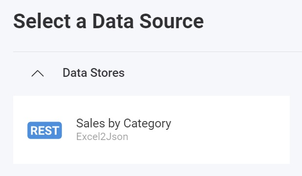

import Tabs from '@theme/Tabs';
import TabItem from '@theme/TabItem';

# REST データ ソースの追加

**手順 1** - `RevealView.onDataSourcesRequested` イベントのイベント ハンドラーを追加します。

```js
var revealView = new $.ig.RevealView("#revealView");
revealView.onDataSourcesRequested = (callback) => {
    //add code here
    callback(new $.ig.RevealDataSources([], [], false));
};
```

**手順 2 ** - `RevealView.onDataSourcesRequested` イベント ハンドラーで、[RVRESTDataSource](https://help.revealbi.io/api/javascript/latest/classes/rvrestdatasource.html) オブジェクトの新しいインスタンスを作成します。REST エンドポイントへのアクセスに認証が必要ない場合は、`URL` プロパティを REST エンドポイントの URL に設定し、`useAnonymousAuthentication` プロパティを false に設定します。`RVRESTDataSource` オブジェクトを作成したら、それをデータ ソース コレクションに追加します。

```js
revealView.onDataSourcesRequested = (callback) => {
    const restDataSource = new $.ig.RVRESTDataSource();
    restDataSource.title = "Sales by Category";
    restDataSource.subtitle = "Excel2Json";
    restDataSource.url = "https://excel2json.io/api/share/6e0f06b3-72d3-4fec-7984-08da43f56bb9";
    restDataSource.useAnonymousAuthentication = true;

    callback(new $.ig.RevealDataSources([restDataSource], [], true));
};
```

アプリケーションが実行されたら、新しい可視化を作成すると、新しく作成された REST データ ソースが [データ ソースの選択] ダイアログに表示されます。




:::info コードの取得

このサンプルのソース コードは、[GitHub](https://github.com/RevealBi/sdk-samples-javascript/tree/main/DataSources/RestService) にあります。

:::