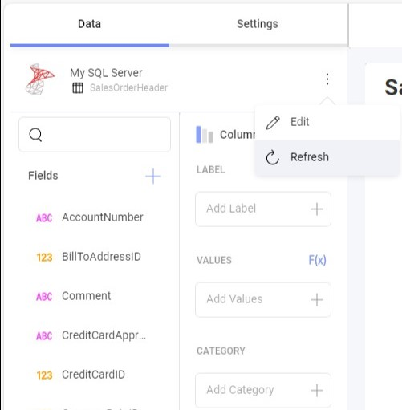
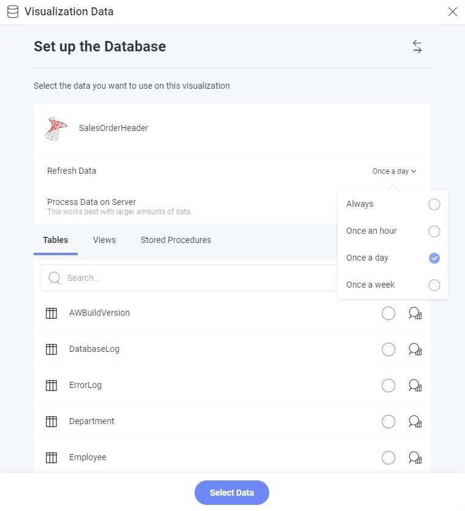

# キャッシュ

Reveal SDK のキャッシュは、クエリされたすべてのデータを、キャッシュと呼ばれる高速な組み込みデータベースに保存することでパフォーマンスを最適化するように設計されたデフォルトの仕組みです。このプロセスにより、頻繁にアクセスされるデータがすぐに利用できるようになり、クエリの開始時に、要求されたデータがすでにキャッシュに存在するかどうかが SDK によって自動的にチェックされます。キャッシュ ヒットの場合、SDK は元のソースへの追加リクエストを必要とせずに、情報を迅速に取得します。

## キャッシュの仕組み
SDK を通じてデータをクエリすると、パイプライン ステップごとに、そのデータを取得するために使用されるすべてのオプションを含む新しい**キー**が作成されます。この**キー**は、パイプライン ステップからの結果データと一緒に保存されます。同じ操作を繰り返すと、各パイプライン ステップに固有のキーが認識され、対応するデータがキャッシュから取得されます。ただし、順序付けやフィルタリングなど、特定のステップのデータ クエリの構成を変更すると、**キー**は一致せず、影響を受けるステップおよびそれ以降のステップで処理が実行されます。この新しいクエリは結果とともに保存されます。たとえば、Excel ファイルから取得したデータの順序を変更しても、ファイルが再度ダウンロードされることはなく、フィルターやその後のステップなど、変更が必要な特定のステップの処理のみが実行されます。

### 処理パイプライン
処理パイプラインは、データがシステムで処理される一連のステージを示します。処理パイプラインを理解することは、キャッシュがどこでどのように動作するかを識別するために重要であり、データ取得の最適化と全体的な処理効率の向上に重要な役割を果たします。

```mermaid
graph LR;
    A[Download Resource]-->B[Create Dataset]-->C[Calculate Fields]-->D[Filter]-->E[Pivot Table Build]-->F[Post Pivot - Calculate Fields]-->G[Post Pivot - Filter];
```

<br/>

- `[Download Resource]` ステージは、通常、CSV/Json/Excel ファイルをダウンロードするリソースベースのデータ ソースを使用する場合にのみ適用されます。
- 要求されたデータによっては、一部のステージがスキップされたり、変更が加えられなかったりする場合があります。たとえば、処理するピボット後の計算フィールドがないか、データ ソースに送信されるクエリにすべてのフィルターが含まれている場合は、`[Filter]` ステップが不要になる可能性があります。
- SSAS データ ソースは別の処理パイプラインを使用するため、これらのステージは SSAS データ ソースには適用されません。

### キャッシュ ファイル
デフォルトでは、キャッシュ ファイルは現在のユーザーの一時ディレクトリ内の `RevealCache_XXXX` という名前のフォルダーに保存されます。`XXXX` はインスタンスを識別する番号です。`CachePath` と `DataCachePath` という 2 つの構成プロパティを使用して、このデフォルトの動作をオーバーライドできます。

```cs
builder.Services
    .AddControllers()
    .AddReveal(revealSetupBuilder =>
    {
        revealSetupBuilder.AddSettings(settings =>
        {
            settings.CachePath = "your-cache-path";
            settings.DataCachePath = "your-data-cache-path";
        });
    });
```

- `CachePath` は、残りのキャッシュ ファイル (ダウンロード ファイルなど) が保存されるディレクトリを指します。デフォルトでは、システムの一時ディレクトリにある `RevealCache_XXXX` という名前のディレクトリになります。
- `DataCachePath` は、ファイル キャッシュ データが保存されるディレクトリを指します。デフォルトは `CachePath` です。

追加のプロパティを構成して、キャッシュ サイズを制御できます。

```cs
builder.Services.AddControllers().AddReveal(revealSetupBuilder =>
{
    revealSetupBuilder.AddSettings(settings =>
    {
        settings.MaxStorageCells = 10000000;
        settings.MaxDownloadSize = 209715200;
        settings.MaxStringCellSize = 256;
        settings.MaxTotalStringsSize = 64000000;
    });
});
```

- `MaxStorageCells` は、任意のデータ ソースから処理されるセルの予想される最大サイズを指します。エンジンは、キャッシュにディスク領域を使いすぎないようにします。この設定は、キャッシュ管理のヒントを提供します。デフォルトは 1000 万セルです。
- `MaxDownloadSize` は、1 回のダウンロード (CSV ファイルなど) の最大サイズをバイト単位で表します。デフォルトは 200 MB です。
- `MaxStringCellSize` は、データセット列の文字列が持つことができる文字数の制限を指します。デフォルトは 256 です。
- `MaxTotalStringsSize` は、すべてのセルの文字の総数として指定された、ピボット テーブルまたはグリッドの予想される最大サイズを指します。この設定によりメモリ管理のヒントを提供し、エンジンによるメモリの過多な使用を避けます。デフォルトは 6400 万です。

### キャッシュの種類
**Download (ダウンロード)** - `[Download Resource]` ステージで使用されるこのキャッシュは、CSV/Excel/Json ファイルからデータを読み取るときに、ダウンロードされたリソースを保存します。ファイルシステム キャッシュは `[RevealCache]/download` に保存され、関連するメタデータは `[RevealCache]/download.sqlite` に保存されます。

個々のダウンロードは、`MaxDownloadSize` 設定で指定されたバイト数によって制限されます。ダウンロード キャッシュの全体的なサイズは 5GB に固定されています。現時点ではこの制限を変更するための API が存在しないことに注意してください。

**Dataset (データセット)** - `[Create Dataset]` ステージと `[Calculate Fields]` ステージで使用されます。

Sqlite ファイルは `[RevealCache]/dataset` に保存され、メタデータは `dataset.sqlite` に存在します。

一部のデータセットはメモリ内に生成され、メモリ内のデータセット キャッシュにも保存されます。

個々のデータセットのサイズは、一連のパラメーターによって間接的に制限されます: `MaxStorageCells` および `MaxTotalStringsSize`。データセット キャッシュの合計サイズは 5 GB に固定されています。現時点では、この制限を変更するために使用できる API はありません。

**Tabular Data (表形式のデータ)** - このキャッシュは、すべてのステージを実行した後の結果を保持します。

データは JSON としてシリアル化され、メモリ内キャッシュに一時的に保存されます。

## キャッシュの更新
キャッシュの更新には、精度を維持し、最新の情報を反映するために、キャッシュ内に保存されているデータを更新することが含まれます。デフォルトでは、キャッシュは `1 日に 1 回`更新されるように設定されています。キャッシュ更新の動作は視覚化 UI から変更でき、ユーザーは特定の要件に基づいて更新期間を変更したり、手動更新をトリガーしたりできます。

メニューの更新オプション (3 つの点で示されている) をクリックするだけで、手動更新をトリガーできます。



データの更新頻度コンボ ボックスから別の値を選択することで、更新頻度を変更できます。このオプションは、データ ソース構成ダイアログで使用できます。

使用できるオプションは以下のとおりです。
- 常に
- 1 時間に 1 回
- 1 日に 1 回
- 週に １ 回



## キャッシュの無効化
キャッシュを無効にすることは利用可能なオプションではありません。ただし、データ ソースのデータ更新頻度を `[常に]` に設定すると、同様の結果が得られます。この構成により、アプリケーションはキャッシュをバイパスして常に新しいデータを取得できるようになります。クエリ中にキャッシュが参照されない場合でも、処理されたデータは保存されることに注意してください。このアプローチでは最新の情報へのアクセスが保証されますが、リアルタイム アクセスを利用する場合、データ ソースへの負荷の増加による潜在的なパフォーマンスへの影響に留意することが重要です。開発者は、デバッグ目的や、頻繁に変更される動的データを扱う場合に、一時的にこの構成を選択することがあります。

キャッシュをバイパスするには、データ ソースのデータ更新頻度を `[常に]` に設定します。


## よくある質問

**質問: キャッシュは多くのディスク領域を消費しますか?**

**答:** キャッシュは約 20 GB を使用するように設計されており、必要に応じて古いエントリが自動的に削除されます。現在、このサイズを調整するための公開設定はありません。

**質問: ディスクがいっぱいになってきていますが、Reveal が原因だと思います。** 

**答え:** バグを報告する前に、OS の一時ディレクトリがクリアされていないか確認してください。Reveal やその他のプロセスは、OS が再起動するまで削除されない可能性がある一時ファイルを生成する場合があります。このディレクトリを定期的に管理するために、クリーンアップ処理をスケジュールすることを考慮してください。Reveal は自動的に削除される一時ファイルをいくつか作成します。そのため、最近作成されたファイルは Reveal で進行中の操作の一部である可能性があるため、クリーンアップ処理によって削除されないようにしてください。さらに、Reveal のキャッシュ フォルダーが OS の一時ディレクトリ内に存在する場合、クリーンアップ処理によって削除されることはありません。

**質問: 異なるユーザーのキャッシュ エントリを分離するにはどうすればよいですか?** 

**答え:** これはセキュリティ上の理由からよく行われます。ただし、異なるユーザーが基になるデータ ソースに対して同等のアクセス権を持っている場合は、キャッシュ エントリを共有することで全体的なパフォーマンスを向上できます。デフォルトでは、Reveal は後者のアプローチを採用します。セキュリティに関しては、次の点に注意する必要があります。
  - 現在のユーザーを識別するには、`IRVUserContextProvider` の `IRVUserContext.UserId` プロパティを設定します。このコンテキストは `IRVDataSourceProvider` および `IRVAuthenticationProvider` でアクセス可能であり、ユーザー固有の決定が可能になります。
  - 現在のユーザーの `IRVDataSourceProvider` でデータ ソースを構成します。データ ソースをユーザーのロールに関連するものに制限し、それに応じてプロパティを調整します (例: Database/Table/CustomQuery プロパティがユーザーの権限と一致していることを確認する)。
  - `IRVAuthenticationProvider` でユーザーに適切な資格情報を割り当てます。

  これらの手順は、キャッシュに関係なく、セキュリティにとって重要です。キャッシュに関しては、Reveal は提供された情報 (データ ソース、資格情報、場合によっては UserId) を利用してキャッシュ エントリを作成します。これらのエントリは、同じデータ ソースと資格情報を共有している場合にのみユーザー間で共有できます。つまり、一致する権限で同一のクエリを実行できることを意味します。

**質問: `IRVUserContext.UserId` はキャッシュエントリにどのような影響を与えますか?**

**答え:** 現在のところ、個別の UserId 値がキャッシュ内に個別のエントリを生成するという保証はありません。ただし、`RVHeadersDataSourceCredentials` 資格情報タイプを使用する場合は、UserId が正しく設定されていることを確認することが重要です。正しく設定されていないと、キャッシュの問題が発生する可能性があります。

**質問: `RVBearerTokenDataSourceCredential.UserId` プロパティはキャッシュ エントリにどのような影響を与えますか?**

**答え:** `RVBearerTokenDataSourceCredential.UserId` が設定されている場合は、キャッシュ エントリ キーの作成時に使用されるため、パフォーマンスを向上させるために設定することをお勧めします。`RVBearerTokenDataSourceCredential` の UserId は `RVBearerTokenDataSourceCredential` アクセス トークンにリンクされた UserId に対応し、`IRVUserContext` の UserId と異なる場合があることに注意してください。

**質問: 導入では、Reveal サーバーのインスタンスが複数存在します。どうすればキャッシュを共有できるのでしょうか?**

**答え:** 現在、キャッシュは複数の Reveal サーバー インスタンス間で共有できません。同じユーザー グループを同じ Reveal サーバー インスタンスに誘導するようにロード バランサーを構成するという次のアプローチをお勧めします。これにより、キャッシュ エントリが特定のインスタンス内に作成され、それらのユーザーからの後続のリクエストは同じインスタンスにヒットし、キャッシュされたデータを効率的に利用できるようになります。
