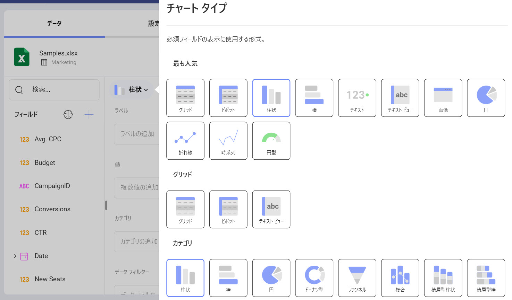

# Chart Types

**Chart Types** represent various types of charts that can be used as a dashboard visualization. When creating or editing a visualization, the chart type is chosen from the Chart Types drop-down menu.



The Reveal SDK provides 37 different types of charts placed in various groups. The groups are as follows:

- Most Popular
- Grids
- Category
- Gauges
- Maps
- Scatter
- Financial
- Time
- Other

## Customizing Chart Types
To modify, remove, or add custom visualizations to the chart types drop down, simply modify the items in the `revealView.chartTypes` array.

### Update Chart Type
To update an existing chart type, find the chart type in the `revealView.chartTypes` property. Modify the various properties of the chart type to either rename, change the icon, or regroup the chart type item.

```js
var barConfig = revealView.chartTypes.find(x => x.chartType == 'BarChart');
barConfig.title = 'My Cool Bar';
barConfig.icon = 'https://help.revealbi.io/img/logo.png';
barConfig.groups = ["Enterprise Visualizations", "HR", "Some Other Category"];
```

### Remove Chart Type
Remove a chart type by finding the index of the chart type item you want remove, and remove it from the `chartTypes` array.

```js
var gridConfig = revealView.chartTypes.find(x => x.chartType == 'Grid');
revealView.chartTypes.splice(revealView.chartTypes.indexOf(gridConfig), 1);
```

### Add Custom Chart Type
Besides updating and removing existing chart type items, you can also add your Custom Visualizations as a new chart type in the Chart Types drop down.

```js
revealView.chartTypes.push({
    title: "Custom Viz",
    url: "https://host/customViz.html", //provide the url to your custom vizualization
    icon: "https://help.revealbi.io/img/logo.png",
    groups: ["Custom Vizualizations"]
});
```

## Set the Default Chart Type
By default, the Reveal SDK sets the `ColumnChart` chart as the default chart type. You can change the default chart type by setting the `revealView.defaultChartType` property to one of the [RVChartType](https://help.revealbi.io/api/javascript/latest/enums/rvcharttype.html) enumeration members.

```js
revealView.defaultChartType = "StackedColumnChart";
```

If you want to set the default chart type to a Custom Visualization, then you need to set the `revealView.defaultCustomChartType` property to the title of the custom visualization.

```js
revealView.defaultChartType = "My Custom Viz";
```

:::info Get the Code

You can find a sample demonstrating Chart Types on [GitHub](https://github.com/RevealBi/sdk-samples-javascript/tree/main/ChartTypes).

:::
