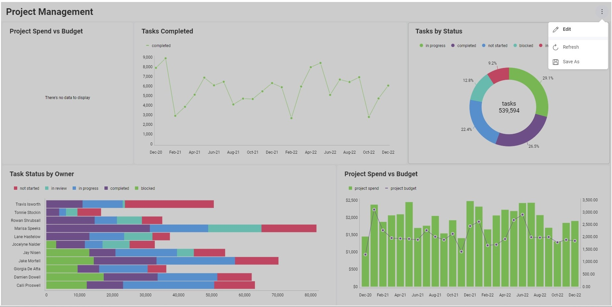

# カスタム メニュー項目

Reveal SDK はカスタム メニュー項目の追加をサポートしており、ユーザーはダッシュボードや可視化のコンテキスト メニューの動作を変更できます。カスタム メニュー項目を追加することで、ユーザーは独自の機能をメニューに組み込むことができます。

メニューを操作するには、クライアントに `revealView.onMenuOpening` イベントのイベント ハンドラーを追加する必要があります。

```js
const revealView = new $.ig.RevealView("#revealView");

revealView.onMenuOpening = function (visualization, args) {
    ...
};
```

`menuLocation` プロパティを利用することで、ダッシュボード全体または可視化全体のメニュー項目の動作をカスタマイズできます。値 `Dashboard` はメニューがダッシュボード上にあることを示し、`Visualization` はメニューが可視化用であることを示します。

```js
const revealView = new $.ig.RevealView("#revealView");

revealView.onMenuOpening = function (visualization, args) {
    //to modify menu behavior on dashboard
    if (args.menuLocation === $.ig.RVMenuLocation.Dashboard) {
       ... 
    }

    // to modify menu behavior on visualizations
    if (args.menuLocation === $.ig.RVMenuLocation.Visualization) {
       ... 
    }
};
```

さらに、可視化の `title` などの追加プロパティに基づいて動作を柔軟にカスタマイズできます。

```js
const revealView = new $.ig.RevealView("#revealView");

revealView.onMenuOpening = function (visualization, args) {
    //to modify menu behavior on dashboard
    if (args.menuLocation === $.ig.RVMenuLocation.Dashboard) {
       ... 
    }

    // to modify menu behavior on visualizations
    if (args.menuLocation === $.ig.RVMenuLocation.Visualization) {
       ... 

        //adding a new menu item to the "Tasks completed" visualization
        if(visualization.title === "Tasks Completed") {
           ...
        }
    }
};
```

## 例: 特定の可視化でのカスタム メニュー項目の作成

**手順 1** - クライアントに `revealView.onMenuOpening` イベントのイベント ハンドラーを追加します。

**手順 2** - クラス `RVMenuItem` の新しいインスタンスを作成し、それを `args.menuItems` 配列にプッシュします。`RVMenuItem` に指定されたコールバックは、クリックされると呼び出されます。

```js
$.ig.RevealSdkSettings.setBaseUrl("https://samples.revealbi.io/upmedia-backend/reveal-api/");

$.ig.RVDashboard.loadDashboard("Project Management").then(dashboard => {
    const revealView = new $.ig.RevealView("#revealView");
    revealView.dashboard = dashboard;

    revealView.onMenuOpening = function (visualization, args) {
        // to modify menu behavior on visualizations
        if (args.menuLocation === $.ig.RVMenuLocation.Visualization) {
            //adding a new menu item to the "Tasks completed" visualization
            if(visualization.title === "Tasks Completed") {
                const menuItem = new $.ig.RVMenuItem("Custom Item on Tasks Completed", new $.ig.RVImage("https://i.pinimg.com/736x/03/c8/a2/03c8a2aff8be6bee9064eef9b5d72d66.jpg", "Icon"), () => {
                    alert('my action');
                })
                args.menuItems.push(menuItem);
            }
        }
    }; 
});
```


## 例: 事前定義されたメニュー項目の非表示

**手順 1** - クライアントに `revealView.onMenuOpening` イベントのイベント ハンドラーを追加します。

**手順 2** - `args.menuItems` 配列で、非表示にする要素を見つけて、その `isHidden` プロパティを `true` に設定します。

```js
$.ig.RevealSdkSettings.setBaseUrl("https://samples.revealbi.io/upmedia-backend/reveal-api/");

$.ig.RVDashboard.loadDashboard("Project Management").then(dashboard => {
    const revealView = new $.ig.RevealView("#revealView");
    revealView.dashboard = dashboard;

    revealView.onMenuOpening = function (visualization, args) {
        //hiding a menu item
        for (let i = 0; i < args.menuItems.length; i++) {
            if(args.menuItems[i].title === "Export") args.menuItems[i].isHidden = true;
        }
    };
});
```



:::info Get the Code

このサンプルのソース コードは、[GitHub](https://github.com/RevealBi/sdk-samples-javascript/tree/main/CustomMenuItems) にあります。

:::