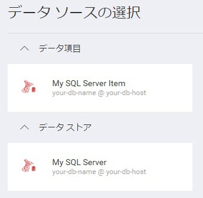

import Tabs from '@theme/Tabs';
import TabItem from '@theme/TabItem';
import DataSourcesTable from '@site/src/components/DataSourcesTable';

# データ ソース

:::danger 重大な変更

現在、Reveal SDK は、Reveal SDK core パッケージからデータ ソースを分離する過程にあります。プロジェクトの継続的な機能を確保するために、プロジェクトに追加のパッケージをインストールすることが必要になる場合があります。詳細については、[サポートされるデータ ソース](web/datasources.md#サポートされるデータ-ソース) トピックを参照してください。

:::

Reveal SDK は、分析ツール、コンテンツ マネージャー、クラウド サービス、CRM、データベース、スプレッドシート、公開データ ソースなど、30 を超えるデータ ソースをサポートしており、毎月さらに多くのデータ ソースが出荷されています。データ ソースは、ダッシュボードのどこからデータが取得されるかを定義します。各データ ソースには、接続文字列、ユーザー ID、パスワードなど、データに接続してデータを取得するためにコードで設定した固有のプロパティがあります。

Reveal SDK には、データ ソースに関して 2 つの概念があります。
1. データ ソース - これはデータの主要なソースです。たとえば、SQL Server をデータ ソースにすることができます。
2. データ ソース項目 - これは、データ ソースから利用できる特定の項目です。例えば、SQL Server の特定のテーブル。

データ ソース (データ ストア) とデータ ソース項目 (データ項目) は、Reveal View の **[データ ソースの選択]** ダイアログで別々に分類されます。



Reveal SDK でデータ ソースを作成するには、2 つの方法があります。
1. クライアント側
2. サーバー側

## データ ソースのインストール

Reveal SDK で使用するデータ ソースを作成する前に、Reveal SDK アプリケーションで使用するデータ ソースごとに正しいパッケージをインストールする必要があります。

**手順 1** - 使用するデータ ソースのパッケージをインストールします。どのデータ ソースがサポートされているか、およびどのパッケージをインストールする必要があるかについては、[サポートされているデータ ソース](#サポートされているデータ-ソース) セクションを参照してください。

**手順 2** - データ ソース パッケージをインストールした後、データ ソースを Reveal SDK に登録します。

<Tabs groupId="code" queryString>
  <TabItem value="aspnet" label="ASP.NET" default>

```cs
using Reveal.Sdk;
using Reveal.Sdk.Data;

builder.Services.AddControllers().AddReveal( builder =>
{
    //all data sources use the RegisterXXX naming convention
    builder.DataSources.RegisterMicrosoftSqlServer();
});
```

  </TabItem>

  <TabItem value="java" label="Java">

```java
Coming Soon...
```

  </TabItem>

  <TabItem value="node" label="Node.js">    

```ts
Coming Soon...
```

  </TabItem>

</Tabs>

## クライアントでのデータ ソースの作成

クライアントでデータ ソースまたはデータ ソース項目を追加するには、`RevealView.onDataSourcesRequested` イベントにイベント ハンドラーを追加します。イベント ハンドラーでは、ダッシュボードで使用されるさまざまなタイプのデータ ソースまたはデータ ソース項目のインスタンスを作成するコードを記述します。次に、これらのインスタンスを `callback` に渡して、**[データ ソースの選択]** ダイアログで使用できるようにします。

```js
var revealView = new $.ig.RevealView("#revealView");
revealView.onDataSourcesRequested = (callback) => {

    //provide all data sources and data source items in callback
    callback(new $.ig.RevealDataSources([], [], false));
};
```
- データ ソースは、コールバックの最初のパラメーターに配列として提供されます。
- データ ソース項目は、コールバックの 2 番目のパラメーターに配列として提供されます。
- 3 番目のパラメーターは、ダッシュボードに保存されているデータ ソースが **[データ ソースの選択]** ダイアログに表示されるかどうかを決定します。`false` の場合、`onDataSourcesRequested` イベントで作成されたデータ ソースのみが表示されます。

クライアントでデータ ソースを作成するときは、データ ソースまたはデータ ソース項目のすべての接続情報を提供することが重要です。例えば、MS SQL Server のデータ ソースを作成する場合は、`host` や `database` などの接続情報を提供する必要があります。データ ソース項目の場合は、`table` を提供する必要があります。

```js
revealView.onDataSourcesRequested = (callback) => {

    var sqlServerDS = new $.ig.RVSqlServerDataSource();
    sqlServerDS.host = "your-db-host";
    sqlServerDS.database = "your-db-name";
    sqlServerDS.title = "My SQL Server";

    var sqlServerDSI = new $.ig.RVSqlServerDataSourceItem(sqlServerDS);
    sqlServerDSI.title = "My SQL Server Item";
    sqlServerDSI.table = "TableName";    

    callback(new $.ig.RevealDataSources([sqlServerDS], [sqlServerDSI], false));
};
```

データ ソースまたはデータ ソース項目で使用できるプロパティについては、データ ソースの対応するヘルプ トピックまたは [API ドキュメント](https://help.revealbi.io/api/javascript/latest/)を参照してください。

:::warning

クライアントで JavaScript を使用してデータ ソースとデータ ソース項目を作成すると、サーバー名、ホスト名、IP アドレス、ポート番号、エンドポイントなどのすべての接続情報がブラウザーに公開されます。これにより、ユーザーはこれらの値を表示できるだけでなく、変更することもできます。公開する情報に注意し、クライアント側のアプローチを使用してデータ ソースを作成することに関連する潜在的なセキュリティ リスクを考慮することが重要です。

:::

## サーバーでのデータ ソースの作成

サーバーでのデータ ソースまたはデータ ソース項目の作成は、クライアントでの作成と似ています。主な違いは、クライアントで接続情報が提供されないことです。`IRVDataSourceProvider` を実装することにより、すべての接続情報がサーバー上で提供されます。

イベント ハンドラーを `RevealView.onDataSourcesRequested` イベントに追加することから始め、データ ソースとデータ ソース項目を作成します。この例では、**MS SQL Server** を使用しています。データ ソースの識別に使用できる `id` と、**[データ ソースの選択]** ダイアログに表示される `title` のみを設定していることに注意してください。

```js
var revealView = new $.ig.RevealView("#revealView");
revealView.onDataSourcesRequested = (callback) => {
    
    var sqlServerDS = new $.ig.RVSqlServerDataSource();
    sqlServerDS.id = "MySqlServerDataSource";
    sqlServerDS.title = "My Sql Server";

    var sqlServerDSI = new $.ig.RVSqlServerDataSourceItem(sqlServerDS);
    sqlServerDSI.id = "MySqlServerDataSourceItem";
    sqlServerDSI.title = "My Sql Server Item";

    callback(new $.ig.RevealDataSources([sqlDataSource], [sqlServerDSI], false));
};
```

次に、サーバー アプリケーションで、データ ソース プロバイダーを作成する必要があります。データ ソース プロバイダーは、Reveal SDK に接続方法を指示するデータ ソースおよびデータ ソース項目のさまざまなプロパティを変更するために使用されます。

データ ソース プロバイダーは、次の 2 つの手順で作成できます。

**手順 1** - データ ソース プロバイダーを作成します。この例では、クライアントで定義された **MS SQL Server** データベースに接続するための接続情報を提供しています。これを実現するために、使用しているデータ ソース/項目のタイプを決定し、オブジェクトで使用可能なプロパティを設定します。

<Tabs groupId="code" queryString>
  <TabItem value="aspnet" label="ASP.NET" default>

```cs
public class DataSourceProvider : IRVDataSourceProvider
{
    public Task<RVDataSourceItem> ChangeDataSourceItemAsync(IRVUserContext userContext, string dashboardId, RVDataSourceItem dataSourceItem)
    {
        if (dataSourceItem is RVSqlServerDataSourceItem sqlServerDsi)
        {
            //required: update underlying data source
            ChangeDataSourceAsync(userContext, sqlServerDsi.DataSource);

            //only change the table if we have selected our data source item
            if (sqlServerDsi.Id == "MySqlServerDatasourceItem")
            {
                //set the table/view
                sqlServerDsi.Table = "Orders";
            }
        }
        return Task.FromResult(dataSourceItem);
    }

    public Task<RVDashboardDataSource> ChangeDataSourceAsync(IRVUserContext userContext, RVDashboardDataSource dataSource)
    {
        if (dataSource is RVSqlServerDataSource sqlDatasource)
        {
            sqlDatasource.Host = "10.0.0.20";
            sqlDatasource.Database = "Northwind";
            sqlDatasource.Schema = "dbo";
        }
        return Task.FromResult(dataSource);
    }
}
```

  </TabItem>

  <TabItem value="java" label="Java">

```java
public class DataSourceProvider implements IRVDataSourceProvider {

    public RVDataSourceItem changeDataSourceItem(IRVUserContext userContext, String dashboardsID, RVDataSourceItem dataSourceItem) {

        if (dataSourceItem instanceof RVSqlServerDataSourceItem sqlServerDsi) {            
            //required: update underlying data source
            changeDataSource(userContext, dataSourceItem.getDataSource());

            //only change the table if we have selected our custom data source item
            if (dataSourceItem.getId() == "MySqlServerDatasourceItem") {
                sqlServerDsi.setTable("Orders");
            }            
        }
        return dataSourceItem;
    }

    public RVDashboardDataSource changeDataSource(IRVUserContext userContext, RVDashboardDataSource dataSource) {
        if (dataSource instanceof RVSqlServerDataSource sqlDatasource) {
            sqlDatasource.setHost("10.0.0.20");
            sqlDatasource.setDatabase("Northwind");
            sqlDatasource.setSchema("dbo");
        }
        return dataSource;
    }
}
```

  </TabItem>

  <TabItem value="node" label="Node.js">    

```ts
const dataSourceItemProvider = async (userContext: IRVUserContext | null, dataSourceItem: RVDataSourceItem) => {
	if (dataSourceItem instanceof RVSqlServerDataSourceItem) {

		//required: update underlying data source
		dataSourceProvider(userContext, dataSourceItem.dataSource);

		//only change the table if we have selected our data source item
		if (dataSourceItem.id === "MySqlServerDatasourceItem") {
			dataSourceItem.table = "Orders";
		}		
	}
	return dataSourceItem;
}

const dataSourceProvider = async (userContext: IRVUserContext | null, dataSource: RVDashboardDataSource) => {
	if (dataSource instanceof RVSqlServerDataSource) {
		dataSource.host = "10.0.0.20";
		dataSource.database = "Northwind";
		dataSource.schema = "dbo";
	}
	return dataSource;
}
```

  </TabItem>

</Tabs>

**手順 2** - データ ソース プロバイダーを Reveal SDK に登録します。

<Tabs groupId="code" queryString>
  <TabItem value="aspnet" label="ASP.NET" default>

```cs
builder.Services.AddControllers().AddReveal( builder =>
{
    builder.AddDataSourceProvider<DataSourceProvider>();
});
```

  </TabItem>

  <TabItem value="java" label="Java">

```java
RevealEngineInitializer.initialize(new InitializeParameterBuilder().
    setDataSourceProvider(new DataSourceProvider()).
    build());
```

  </TabItem>

  <TabItem value="node" label="Node.js">    

```ts
const revealOptions: RevealOptions = {
	dataSourceProvider: dataSourceProvider,
	dataSourceItemProvider: dataSourceItemProvider,
}
app.use('/', reveal(revealOptions));
```

  </TabItem>

</Tabs>

:::danger Important

`ChangeDataSourceAsync` メソッドでデータ ソースに加えられた変更は、`ChangeDataSourceItemAsync` メソッドには引き継がれません。どちらの方法でも、データ ソース プロパティを**更新する必要があります**。上記の例に示すように、`ChangeDataSourceItemAsync` メソッド内で `ChangeDataSourceAsync` メソッドを呼び出し、データ ソース項目の基になるデータ ソースをパラメーターとして渡すことをお勧めします。

:::

## サポートされるデータ ソース

:::tip 今後の拡張機能

現在、Reveal SDK は、Reveal SDK core パッケージからデータ ソースを分離する過程にあります。これにより、アプリケーションのサイズが削減されるだけでなく、新しいデータ ソースのリリースや既存のデータ ソースの更新も容易になります。Reveal SDK の次の進化に向けて取り組んでまいりますので、今しばらくお待ちいただきますようお願いいたします。

:::

以下の表を使用して、サポートされているデータ ソースと、ターゲット フレームワークにインストールする必要があるパッケージを確認してください。

<DataSourcesTable></DataSourcesTable>

**SDK に含まれている** - このデータ ソースにインストールするための個別のパッケージはありません。データ ソースは Reveal SDK に含まれています。