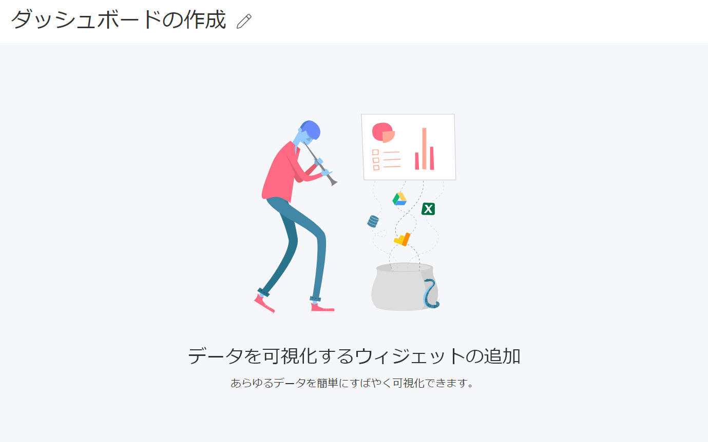

# Reveal SDK for Angular で作業を開始

## 手順 1 - Angular アプリの作成

1 - お気に入りのターミナルを開きます。


2 - アプリケーションを作成します。

```bash
ng new getting-started
```

3 - ディレクトリを新しく作成した app ディレクトリに移動し、お気に入りのエディターでプロジェクトを開きます。この例では、Visual Studio Code を使用しています。

```bash
cd getting-started
code .
```

## 手順 2 - Reveal JavaScript API の追加

1 - `index.html` ファイルを開いて変更し、ページの下部に (`</body>` 終了タグの直前) `infragistics.reveal.js` スクリプトを含めます。

```html
<script src="https://dl.revealbi.io/reveal/libs/[var:sdkVersion]/infragistics.reveal.js"></script>
```

2 - 残りの Reveal JavaScript API 依存関係をインストールします。

- Jquery 2.2 またはそれ以降

```html
<script src="https://cdn.jsdelivr.net/npm/jquery@3.6.0/dist/jquery.min.js"></script>
```

- Day.js 1.8.15 またはそれ以降

```html
<script src="https://unpkg.com/dayjs@1.8.21/dayjs.min.js"></script>
```

最終の `index.html` ファイルは以下のようになります。

```html title="index.html" {9,14-17}
<!doctype html>
<html lang="en">
<head>
  <meta charset="utf-8">
  <title>GettingStarted</title>
  <base href="/">
  <meta name="viewport" content="width=device-width, initial-scale=1">
  <link rel="icon" type="image/x-icon" href="favicon.ico">
</head>
<body>
  <app-root></app-root>

  //highlight-start
  <script src="https://cdn.jsdelivr.net/npm/jquery@3.6.0/dist/jquery.min.js"></script>
  <script src="https://unpkg.com/dayjs@1.8.21/dayjs.min.js"></script>
  <script src="https://dl.revealbi.io/reveal/libs/[var:sdkVersion]/infragistics.reveal.js"></script>
  //highlight-end
</body>
</html>
```

## 手順 3 - Reveal ビューの初期化

1 - `src/app/app.component.html` ファイルを開いて変更します。ファイルのすべての内容を削除し、新しい `<div>` タグを追加して、参照を `revealView` に設定します。

```html
<div #revealView style="height: 100vh; width: 100%; position:relative;"></div>
```

2 - `src/app/app.component.ts` ファイルを開いて変更します。最初に、import ステートメントの下のファイルの先頭で、タイプ `any` の `$` という名前の新しい変数を宣言することによって、jQuery を使用できることを確認する必要があります。これにより、TypeScript が JavaScript をコンパイルします。

```ts
declare let $: any;
```

次に、HTML で `ViewChild` として定義した `revalView` にアクセスします。この参照を保持するプロパティを追加します。

```ts title="src/app/app.component.html"
export class AppComponent {
  
  // highlight-next-line
  @ViewChild('revealView') el!: ElementRef;
  
}
```

コンポーネントに `AfterViewInit` インターフェイスを実装する必要があります。

```ts title="src/app/app.component.html" {5-7}
export class AppComponent implements AfterViewInit {
  
  @ViewChild('revealView') el!: ElementRef;

  ngAfterViewInit(): void {

  }
  
}
```

それが完了したら、`RevealView` を初期化できます。

```ts title="src/app/app.component.html"
export class AppComponent implements AfterViewInit {
  
  @ViewChild('revealView') el!: ElementRef;

  ngAfterViewInit(): void {
    // highlight-next-line
    var revealView = new $.ig.RevealView(this.el.nativeElement);
  }
  
}
```

次に、新しい `$.ig.RevealView` を作成し、`ViewChild` プロパティに保存されている `revealView` 要素を渡すことで、`RevealView` の新しいインスタンスを作成します。

最終の `app.component.ts` ファイルは以下のようになります。

```ts title="src/app/app.component.html"
import { AfterViewInit, Component, ElementRef, ViewChild } from '@angular/core';

declare let $: any;

@Component({
  selector: 'app-root',
  templateUrl: './app.component.html',
  styleUrls: ['./app.component.scss']
})
export class AppComponent implements AfterViewInit {
  
  @ViewChild('revealView') el!: ElementRef;

  ngAfterViewInit(): void {
    var revealView = new $.ig.RevealView(this.el.nativeElement);
  }
  
}
```

:::caution

クライアント アプリは、クライアントが別の URL でホストしている場合、`$.ig.RevealSdkSettings.setBaseUrl("url-to-server");` をダッシュボードをホストしているサーバー アドレスに設定する必要があります。

:::

## 手順 4 - アプリケーションの実行

Visual Studio Code ターミナルで、`npm start` コマンドを入力します。

```bash npm2yarn
npm start
```



完了しました! 最初の Reveal SDK Angular アプリケーションを作成しました。

:::info コードの取得

このサンプルのソース コードは [GitHub](https://github.com/RevealBi/sdk-samples-javascript/tree/main/01-GettingStarted/client/angular) にあります。

:::
