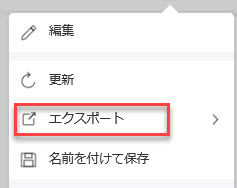
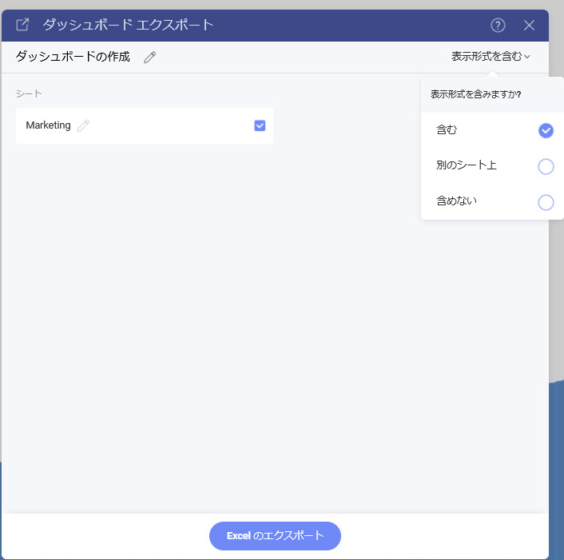
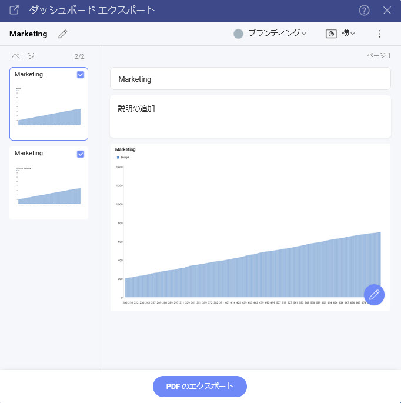
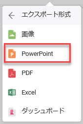

# エクスポート

Reveal SDK を使用すると、ダッシュボードと表示形式の両方をエクスポートして、新しいドキュメント タイプまたは画像を生成できます。

サポートされているダッシュボードのエクスポート形式:
- Excel
- 画像
- JSON
- PDF
- PowerPoint

サポートされている視覚化エクスポート形式:
- Excel
- 画像

すべてのエクスポート オプションは、ダッシュボードを開いたとき、または視覚化を最大化したときに、`RevealView` オーバー フロー メニューの **[エクスポート]** メニュー項目の中にあります。



ユーザーが **[エクスポート]** ボタンをクリックすると、有効なエクスポート オプションの 1 つを選択できます。

## Excel へエクスポート
エンドユーザーが **[エクスポート]** オーバーフロー メニューから **[Excel]** メニュー項目をクリックすると、Excel のエクスポートが実行されます。


**[Excel]** メニュー項目は、`RevealView.ShowExportToExcel` プロパティを設定することで表示/非表示にできます。

```xml
<rv:RevealView x:Name="_revealView" ShowExportToExcel="False" />
```

**[Excel]** メニュー項目をクリックすると、エンドユーザーは、ワークブックのタイトル、ワークシートのタイトル、作成するワークシート、および表示形式を含めるかどうかを変更できるさまざまなオプションを求められます。




## 画像へのエクスポート
Reveal SDK では、ダッシュボードまたは表示形式を画像にエクスポートする方法が 2 つあります:
- エンドユーザーによるエクスポート
- プログラムでエクスポート

### エンドユーザーによる画像エクスポート
エンドユーザーの画像のエクスポートは、エンドユーザーが **[エクスポート]** オーバーフロー メニューから **[画像]** メニュー項目をクリックすると実行されます。


**[画像]** メニュー項目は、`RevealView.ShowExportImage` プロパティを設定することで表示/非表示にできます。

```xml
<rv:RevealView x:Name="_revealView" ShowExportImage="False" />
```

**[画像]** メニュー項目をクリックすると、エンドユーザーにダイアログが表示され、画像をクリップボードにコピーするか、組み込みの画像エディターを使用して画像を編集するか、画像を PNG としてディスクに保存するかを選択できます。


#### カスタム画像のエクスポート
デフォルトでは、エンドユーザーが **[画像をエクスポート]** ダイアログの **[画像をエクスポート]** ボタンをクリックすると、**[ファイルを保存]** ダイアログがエンドユーザーに表示され、画像ファイルを保存する名前と場所を選択できます。ただし、この動作は傍受される可能性があり、代わりにカスタム画像エクスポート ロジックを使用できます。

カスタム画像エクスポートを使用するには、`RevealView.ImageExported` イベントにイベント ハンドラーを追加する必要があります。

```cs
private void RevealView_ImageExported(object sender, ImageExportedEventArgs e)
{

}
```

`ImageExportedEventArgs` オブジェクトは、画像のエクスポートを保存するのに役立つ次のプロパティを提供します:
- **Image** - `BitmapSource` として取得されたダッシュボードのスクリーンショット
- **CloseExportDialog** - エクスポート ダイアログの表示を制御するブール プロパティ。True の場合、ダイアログは閉じます。False の場合、ダイアログは開いたままになります。

#### 例: カスタム画像のエクスポート

```cs
private void RevealView_ImageExported(object sender, ImageExportedEventArgs e)
{
    var image = e.Image;

    var saveDialog = new SaveFileDialog()
    {
        DefaultExt = ".png",
        FileName = _revealView.Dashboard.Title + ".png",
    };

    if (saveDialog.ShowDialog() == true)
    {
        using (var fileStream = new FileStream(saveDialog.FileName, FileMode.Create))
        {
            BitmapEncoder encoder = new PngBitmapEncoder();
            encoder.Frames.Add(BitmapFrame.Create(image));
            encoder.Save(fileStream);
        }
    }
    else
    {
        e.CloseExportDialog = false;
    }
}

```

### プログラムで画像のエクスポート
エンドユーザーの操作なしでダッシュボードの画像をプログラムでエクスポートするには、`RevealView.ToImage` メソッドを呼び出す必要があります。`RevealView.ToImage` メソッドを呼び出すと、画面に表示されている RevealView コンポーネントのスクリーンショットが作成されます。``RevealView.ToImage`` メソッドは、[画像をエクスポート] ダイアログでユーザーにプロンプトを**表示しません**。

```cs
var image = _revealView.ToImage();
```

#### 例: プログラムで画像のエクスポート

```cs
private void ExportButton_Click(object sender, RoutedEventArgs e)
{
    var image = _revealView.ToImage();
    var desktopPath = Environment.GetFolderPath(Environment.SpecialFolder.DesktopDirectory);
    var filePath = Path.Combine(desktopPath, $"{_revealView.Dashboard.Title}.png");

    using (var fileStream = new FileStream(filePath, FileMode.Create))
    {
        BitmapEncoder encoder = new PngBitmapEncoder();
        encoder.Frames.Add(BitmapFrame.Create(image));
        encoder.Save(fileStream);
    }            
}
```

:::info コードの取得

このサンプルのソース コードは [GitHub](https://github.com/RevealBi/sdk-samples-wpf/tree/master/Exporting-Image) にあります。

:::

## JSON へエクスポート
ダッシュボードを **JSON** 文字列にエクスポートします。

```cs
var json = dashboard.ExportToJson();
```

## PDF へのエクスポート
PDF エクスポートは、エンドユーザーが **[エクスポート]** オーバーフロー メニューから **[PDF]** メニュー項目をクリックすると実行されます。


**[PDF]** メニュー項目は、`RevealView.ShowExportToPDF` プロパティを設定することで表示/非表示にできます。

```xml
<rv:RevealView x:Name="_revealView" ShowExportToPDF="False" />
```

**[PDF]** メニュー項目をクリックすると、エンドユーザーにさまざまなオプションの入力を求められます。これにより、ユーザーは PDF ドキュメントのタイトルを変更したり、ドキュメントに含める表示形式、各表示形式のタイトルと説明、ブランド、ページの向き、言語を選択ができます。



## PowerPoint へエクスポート
エンドユーザーが [エクスポート] オーバーフロー メニューから **[PowerPoint]** メニュー項目をクリックすると、PowerPoint のエクスポートが実行されます。



**PowerPoint** メニュー項目は、`RevealView.ShowExportToPowerpoint` プロパティを設定することで表示/非表示にできます。

```xml
<rv:RevealView x:Name="_revealView" ShowExportToPowerpoint="False" />
```

**PowerPoint** メニュー項目をクリックすると、エンドユーザーは、PowerPoint ドキュメントのタイトルを変更したり、ドキュメントに含める表示形式、各表示形式のタイトルと説明、およびブランディングを選択したりできるさまざまなオプションが表示されます。

